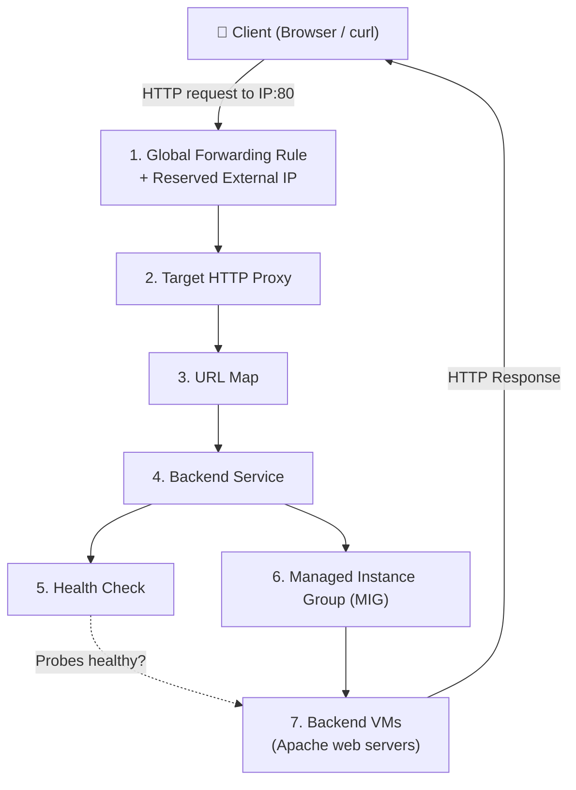
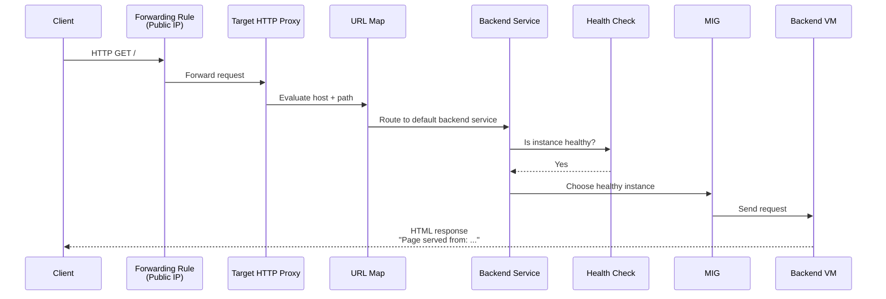

# **GSP155 – Set Up Application Load Balancers** 

---

## **1. Basics – What is Load Balancing?**

**Load Balancing** distributes incoming traffic across multiple backend servers (VMs, containers, etc.) so that:

- No single server is overloaded
- High availability is achieved (if one server dies, others continue)
- Performance improves (users get faster responses)

### **Types of Load Balancers in Google Cloud**

| Type                        | OSI Layer | Protocol          | Use Case                              | Scope          |
|-----------------------------|-----------|-------------------|---------------------------------------|----------------|
| **Application Load Balancer** | Layer 7   | HTTP / HTTPS      | Web apps, content-based routing       | Global / Regional |
| Network Load Balancer (Proxy) | Layer 4   | TCP / SSL         | Non-HTTP apps that need proxying      | Global / Regional |
| Network Load Balancer (Passthrough) | Layer 4 | TCP / UDP / ESP / ICMP | High-performance, preserve client IP | Regional / Global |

**This lab focuses on External Application Load Balancer (classic / global mode using Google Front Ends – GFEs).**

---

## 2. Why Application Load Balancer (Layer 7)?

- Understands **HTTP/HTTPS** (URL path, headers, cookies, host, query parameters)
- Can do **content-based routing** (e.g., `/video` → one backend, `/images` → Cloud Storage)
- SSL/TLS termination at the edge (close to the user)
- Built on **Google Front Ends (GFEs)** – globally distributed
- In Premium Network Service Tier → traffic is routed to the **closest healthy backend** with capacity

---

## 3. Architecture – Components of External Application Load Balancer



### Component Roles (Exam Critical)

| Component              | Role |
|------------------------|------|
| **Forwarding Rule**    | Frontend. Holds the public IP + port. Sends traffic to Target Proxy. |
| **Target HTTP Proxy**  | Terminates the client connection and uses the URL Map. |
| **URL Map**            | Routing rules (host + path). Decides which Backend Service gets the request. |
| **Backend Service**    | Defines how to distribute traffic, which health check to use, session affinity, etc. |
| **Health Check**       | Continuously probes backends. Only healthy instances receive traffic. |
| **Instance Template**  | Blueprint for creating identical VMs. |
| **Managed Instance Group (MIG)** | Auto-creates, heals, and scales VMs based on the template. |
| **Firewall Rules**     | Allow health-check probes + (optionally) client traffic. |

---

## 4. Complete Lab Flow (Correct Order)

```mermaid
flowchart LR
    A[Set Region/Zone] --> B[Create Instance Template]
    B --> C[Create Managed Instance Group]
    C --> D[Create Firewall for Health Checks]
    D --> E[Reserve Global Static IP]
    E --> F[Create Health Check]
    F --> G[Create Backend Service]
    G --> H[Add MIG as Backend]
    H --> I[Create URL Map]
    I --> J[Create Target HTTP Proxy]
    J --> K[Create Forwarding Rule]
    K --> L[Test Traffic]
```



> **Important Note from your session:**  
> You created some resources out of order and hit “already exists” errors.  
> Always create **Instance Template → MIG → Firewall → IP → Health Check → Backend Service → add-backend → URL Map → Proxy → Forwarding Rule**.

---

## 5. Step-by-Step Commands with Word-by-Word Explanation

### Task 1 – Set Default Region & Zone

```bash
gcloud config set compute/region us-east4
```

| Word / Flag              | Meaning |
|--------------------------|---------|
| `gcloud`                  | Google Cloud CLI tool |
| `config`                 | Manage configuration properties |
| `set`                    | Set a property |
| `compute/region`         | Property for default Compute Engine region |
| `us-east4`               | The region value (Northern Virginia) |

```bash
gcloud config set compute/zone us-east4-b
```

| Word / Flag              | Meaning |
|--------------------------|---------|
| `compute/zone`           | Default zone property |
| `us-east4-b`             | Specific zone inside the region |

---

### Task 2 – Create Web Server Instances (Optional in this lab – for testing)

These are **standalone** VMs (not part of the load balancer). They demonstrate basic Apache setup.

```bash
gcloud compute instances create www1 \
  --zone=us-east4-b \
  --tags=network-lb-tag \
  --machine-type=e2-small \
  --image-family=debian-12 \
  --image-project=debian-cloud \
  --metadata=startup-script='#!/bin/bash
    apt-get update
    apt-get install apache2 -y
    service apache2 restart
    echo "<h3>Web Server: www1</h3>" | tee /var/www/html/index.html'
```

| Part | Explanation |
|------|-------------|
| `gcloud compute instances create` | Create a Compute Engine VM |
| `www1` | Name of the instance |
| `--zone=` | Zone where the VM will live |
| `--tags=` | Network tags (used later by firewall rules) |
| `--machine-type=e2-small` | Cost-effective shared-core machine |
| `--image-family=debian-12` | Latest Debian 12 image |
| `--image-project=debian-cloud` | Official Debian project |
| `--metadata=startup-script=...` | Script that runs automatically on first boot |
| `apt-get update && install apache2` | Install Apache web server |
| `echo ... | tee /var/www/html/index.html` | Write a simple homepage |

Repeat for `www2` and `www3` (just change the name and the HTML content).

**Firewall for these standalone VMs:**

```bash
gcloud compute firewall-rules create www-firewall-network-lb \
  --target-tags=network-lb-tag \
  --allow=tcp:80
```

| Part | Explanation |
|------|-------------|
| `firewall-rules create` | Create a VPC firewall rule |
| `--target-tags=` | Apply only to VMs that have this tag |
| `--allow=tcp:80` | Allow inbound TCP traffic on port 80 |

---

### Task 3 – Create Application Load Balancer (Main Part)

#### 3.1 Create Instance Template

```bash
gcloud compute instance-templates create lb-backend-template \
  --region=us-east4 \
  --network=default \
  --subnet=default \
  --tags=allow-health-check \
  --machine-type=e2-medium \
  --image-family=debian-12 \
  --image-project=debian-cloud \
  --metadata=startup-script='#!/bin/bash
    apt-get update
    apt-get install apache2 -y
    a2ensite default-ssl
    a2enmod ssl
    vm_hostname="$(curl -H "Metadata-Flavor:Google" \
      http://169.254.169.254/computeMetadata/v1/instance/name)"
    echo "Page served from: $vm_hostname" | \
      tee /var/www/html/index.html
    systemctl restart apache2'
```

| Part | Explanation |
|------|-------------|
| `instance-templates create` | Create a reusable template for VMs |
| `--region=` | Region for the template |
| `--network=default` | Use the default VPC |
| `--subnet=default` | Use the default subnet |
| `--tags=allow-health-check` | Tag that will be used by the health-check firewall |
| `--machine-type=e2-medium` | Slightly larger than e2-small |
| `Metadata-Flavor:Google` | Required header to query the metadata server |
| `169.254.169.254` | Special IP of the Compute Engine metadata server |
| `$vm_hostname` | Dynamically gets the actual instance name so each page shows which VM served it |

#### 3.2 Create Managed Instance Group (MIG)

```bash
gcloud compute instance-groups managed create lb-backend-group \
  --template=lb-backend-template \
  --size=2 \
  --zone=us-east4-b
```

| Part | Explanation |
|------|-------------|
| `instance-groups managed create` | Create a **Managed** Instance Group |
| `--template=` | Which template to use |
| `--size=2` | Start with 2 VMs |
| `--zone=` | Zone for the group (zonal MIG) |

> MIG automatically creates, heals, and can autoscale the VMs.

#### 3.3 Firewall Rule for Health Checks (Critical!)

```bash
gcloud compute firewall-rules create fw-allow-health-check \
  --network=default \
  --action=allow \
  --direction=ingress \
  --source-ranges=130.211.0.0/22,35.191.0.0/16 \
  --target-tags=allow-health-check \
  --rules=tcp:80
```

| Part | Explanation |
|------|-------------|
| `--source-ranges=130.211.0.0/22,35.191.0.0/16` | **Google’s official health-check probe IP ranges** (must allow these) |
| `--target-tags=allow-health-check` | Only VMs with this tag receive the rule |
| `--rules=tcp:80` | Allow HTTP probes |

> These ranges are the same for both health checks **and** Google Front End (GFE) traffic in classic/global Application Load Balancers.

#### 3.4 Reserve Global Static External IP

```bash
gcloud compute addresses create lb-ipv4-1 \
  --ip-version=IPV4 \
  --global
```

```bash
gcloud compute addresses describe lb-ipv4-1 \
  --format="get(address)" \
  --global
```

| Part | Explanation |
|------|-------------|
| `addresses create` | Reserve a static IP |
| `--ip-version=IPV4` | IPv4 address |
| `--global` | Global scope (required for classic/global Application LB) |
| `describe ... --format="get(address)"` | Print only the IP address |

**Save this IP** – you will use it later for testing.

#### 3.5 Create HTTP Health Check

```bash
gcloud compute health-checks create http http-basic-check \
  --port=80
```

| Part | Explanation |
|------|-------------|
| `health-checks create http` | Create an HTTP health check |
| `http-basic-check` | Name of the health check |
| `--port=80` | Probe port 80 |

#### 3.6 Create Backend Service

```bash
gcloud compute backend-services create web-backend-service \
  --protocol=HTTP \
  --port-name=http \
  --health-checks=http-basic-check \
  --global
```

| Part | Explanation |
|------|-------------|
| `backend-services create` | Create the backend service |
| `--protocol=HTTP` | Protocol used between load balancer and backends |
| `--port-name=http` | Named port (must match the port name on the instance group if defined) |
| `--health-checks=` | Which health check to use |
| `--global` | Global backend service (for global/classic Application LB) |

#### 3.7 Attach the MIG as Backend

```bash
gcloud compute backend-services add-backend web-backend-service \
  --instance-group=lb-backend-group \
  --instance-group-zone=us-east4-b \
  --global
```

| Part | Explanation |
|------|-------------|
| `add-backend` | Attach a backend to the service |
| `--instance-group=` | The MIG name |
| `--instance-group-zone=` | Zone of the MIG |
| `--global` | Because the backend service is global |

#### 3.8 Create URL Map

```bash
gcloud compute url-maps create web-map-http \
  --default-service=web-backend-service
```

| Part | Explanation |
|------|-------------|
| `url-maps create` | Create a URL map |
| `--default-service=` | Backend service used when no host/path rule matches |

> Advanced: You can add host rules and path matchers later for content-based routing.

#### 3.9 Create Target HTTP Proxy

```bash
gcloud compute target-http-proxies create http-lb-proxy \
  --url-map=web-map-http
```

| Part | Explanation |
|------|-------------|
| `target-http-proxies create` | Create the HTTP target proxy |
| `--url-map=` | Which URL map this proxy should use |

#### 3.10 Create Global Forwarding Rule (Frontend)

```bash
gcloud compute forwarding-rules create http-content-rule \
  --address=lb-ipv4-1 \
  --global \
  --target-http-proxy=http-lb-proxy \
  --ports=80
```

| Part | Explanation |
|------|-------------|
| `forwarding-rules create` | Create the frontend |
| `--address=` | The reserved static IP |
| `--global` | Global forwarding rule |
| `--target-http-proxy=` | Which proxy to send traffic to |
| `--ports=80` | Accept traffic on port 80 |

---

## 6. Testing the Load Balancer

1. Go to **Load balancing** in the console → click `web-map-http`
2. Wait until both backends show **Healthy**
3. Open browser or use curl:

```bash
curl http://34.13.116.28          # replace with your IP
```

You should see:
```
Page served from: lb-backend-group-xxxx
```

Refresh multiple times – the hostname will change between the two VMs (round-robin / capacity-based).

---

## 7. Traffic Flow (Detailed Mermaid)



---

## 8. Common Errors You Hit & How to Fix

| Error | Cause | Fix |
|-------|-------|-----|
| Resource already exists | You ran the same create command twice | Use `describe` or `list` to verify, or delete and recreate |
| Backends not healthy | Firewall missing or wrong source ranges | Ensure `130.211.0.0/22` and `35.191.0.0/16` are allowed |
| Connection timeout | Forwarding rule not created or IP wrong | Check forwarding rule and use the correct IP |
| Order of creation | Tried to add backend before MIG existed | Always create MIG first |

**Useful cleanup commands (if needed):**

```bash
gcloud compute forwarding-rules delete http-content-rule --global --quiet
gcloud compute target-http-proxies delete http-lb-proxy --quiet
gcloud compute url-maps delete web-map-http --quiet
gcloud compute backend-services delete web-backend-service --global --quiet
gcloud compute health-checks delete http-basic-check --quiet
gcloud compute addresses delete lb-ipv4-1 --global --quiet
gcloud compute instance-groups managed delete lb-backend-group --zone=us-east4-b --quiet
gcloud compute instance-templates delete lb-backend-template --quiet
gcloud compute firewall-rules delete fw-allow-health-check --quiet
```

---

## 9. Advanced Concepts (Exam Focus)

### 9.1 Global vs Regional Application Load Balancer

| Feature                    | Global / Classic          | Regional                  |
|----------------------------|---------------------------|---------------------------|
| Scope                      | Global                    | Single region             |
| Implementation             | Google Front Ends (GFE)   | Envoy proxies             |
| Network Service Tier       | Premium (recommended)     | Standard or Premium       |
| Multi-region backends      | Yes                       | No                        |
| Advanced traffic management| Limited (classic) / Full (global EXTERNAL_MANAGED) | Full |

### 9.2 Health Check Source Ranges (Memorize)

- **Application Load Balancer (global/classic):**  
  `130.211.0.0/22` + `35.191.0.0/16`

### 9.3 Named Ports

When using instance groups, you can define named ports:

```bash
gcloud compute instance-groups set-named-ports lb-backend-group \
  --named-ports=http:80 \
  --zone=us-east4-b
```

Then reference `--port-name=http` in the backend service.

### 9.4 Autoscaling with Load Balancing

You can attach an autoscaler to the MIG that scales based on:

- CPU utilization
- HTTP load balancing serving capacity (RPS or utilization)

### 9.5 SSL / HTTPS Load Balancer

For HTTPS you need:

1. SSL certificate (Google-managed or self-managed)
2. Target **HTTPS** proxy instead of HTTP proxy
3. Forwarding rule on port 443

---

## 10. Key Takeaways for Cloud Architect Exam

1. Application Load Balancer = **Layer 7** = understands HTTP.
2. Components order: **Template → MIG → Firewall → IP → Health Check → Backend Service → URL Map → Proxy → Forwarding Rule**.
3. Health-check firewall **must** allow Google’s probe ranges.
4. Global static IP + global forwarding rule = single anycast IP for the whole world.
5. URL Map is the brain for content-based routing.
6. Managed Instance Groups give you autohealing + autoscaling for free.

---

## 11. Official Documentation Links

- [Application Load Balancer overview](https://docs.cloud.google.com/load-balancing/docs/application-load-balancer)
- [External Application Load Balancer overview](https://docs.cloud.google.com/load-balancing/docs/https)
- [Health checks](https://docs.cloud.google.com/load-balancing/docs/health-check-concepts)
- [Firewall rules for load balancing](https://docs.cloud.google.com/load-balancing/docs/firewall-rules)
- [Set up classic Application Load Balancer with MIG](https://docs.cloud.google.com/load-balancing/docs/https/setting-up-http)

---

**You are now ready for the next load balancing labs (Network Load Balancer, Internal LB, etc.).**  
Just paste the next lab documentation when you are ready!
