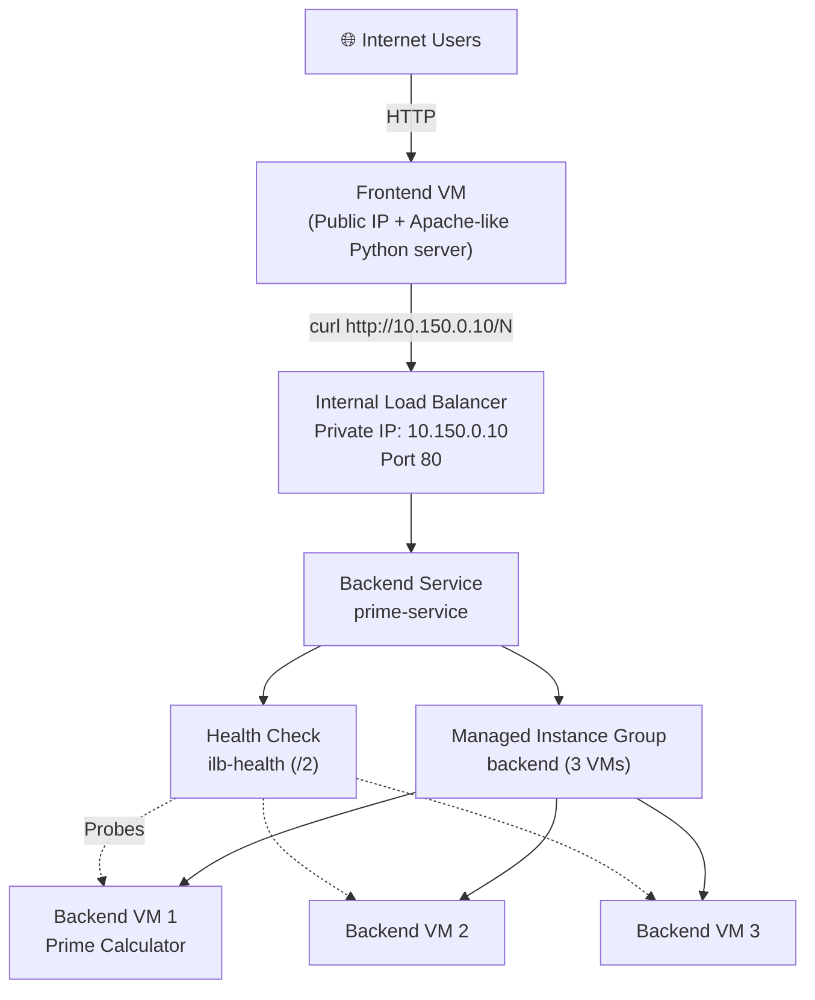
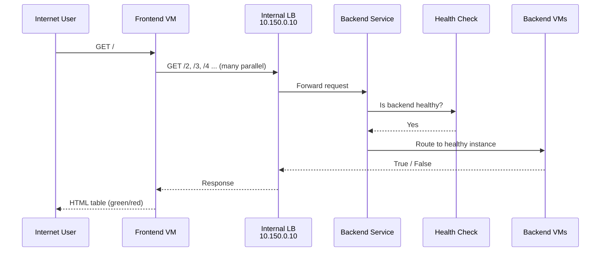

# **GSP041 – Use an Internal Application Load Balancer**  

## **1. Basics – What is an Internal Load Balancer?**

An **Internal Load Balancer** distributes traffic **inside** your VPC network (or networks connected to it).  

Key differences from External Load Balancer:

| Feature                    | External Application LB          | Internal Application / TCP LB          |
|----------------------------|----------------------------------|----------------------------------------|
| Accessible from            | Internet                         | Only inside VPC (or connected networks)|
| IP Address                 | Public / Global anycast          | Private IP from your VPC subnet        |
| Security                   | Needs Cloud Armor, HTTPS, etc.   | Inherently more secure (no public exposure) |
| Typical use                | Public websites, APIs            | Microservices, internal APIs, databases, backend tiers |
| Implementation (modern)    | GFE or Envoy                     | Envoy proxies (for L7) or Andromeda    |

**This lab builds a classic multi-tier architecture:**

```
Internet → Frontend Web Server (public) → Internal Load Balancer → Backend Prime Calculator VMs (private)
```

---

## 2. Why Use an Internal Load Balancer?

- **Security**: Backend VMs have **no public IP** (`--no-address`). They can only be reached from inside the VPC.
- **High Availability**: If one backend dies, traffic automatically goes to healthy ones.
- **Single stable IP**: Other services (like the frontend) only need to know one private IP.
- **Scalability**: Easy to add more backends without changing clients.

---

## 3. Architecture of This Lab



### Components Used in This Lab

| Component              | Name in Lab          | Purpose |
|------------------------|----------------------|---------|
| Instance Template      | `primecalc`          | Blueprint for backend VMs (no public IP) |
| Managed Instance Group | `backend`            | 3 identical prime-calculator VMs |
| Firewall (Backend)     | `http`               | Allow port 80 from internal subnet |
| Health Check           | `ilb-health`         | HTTP check on path `/2` |
| Backend Service        | `prime-service`      | Ties health check + instance group |
| Forwarding Rule        | `prime-lb`           | Private VIP `10.150.0.10:80` |
| Frontend VM            | `frontend`           | Public web UI that calls the ILB |
| Firewall (Frontend)    | `http2`              | Allow port 80 from anywhere (`0.0.0.0/0`) |

> **Note**: This lab uses a simplified **Internal TCP Load Balancer** style (protocol TCP + load-balancing-scheme=internal).  
> Modern **Internal Application Load Balancer** (L7) uses `INTERNAL_MANAGED`, regional URL maps, target proxies, and a **proxy-only subnet**. The concepts are the same for the exam.

---

## 4. Complete Lab Flow

```mermaid
flowchart LR
    A[Set Region/Zone] --> B[Create backend.sh]
    B --> C[Create Instance Template]
    C --> D[Create Firewall for backends]
    D --> E[Create Managed Instance Group]
    E --> F[Create Health Check]
    F --> G[Create Backend Service]
    G --> H[Add MIG as Backend]
    H --> I[Create Forwarding Rule]
    I --> J[Test from testinstance]
    J --> K[Create frontend.sh + Frontend VM]
    K --> L[Open Firewall for Frontend]
    L --> M[Browse Public IP]
```



---

## 5. Step-by-Step Commands with Full Explanation

### Task 0 – Set Region & Zone

```bash
gcloud config set compute/region us-east4
gcloud config set compute/zone us-east4-c
```

| Flag / Value     | Meaning |
|------------------|---------|
| `compute/region` | Default region for regional resources |
| `compute/zone`   | Default zone for zonal resources (us-east4-c) |

---

### Task 1 – Create Virtual Environment (Optional but in lab)

```bash
sudo apt-get install -y virtualenv
python3 -m venv venv
source venv/bin/activate
```

This isolates Python packages. Not strictly required for the load balancer itself.

---

### Task 2 – Create Backend Managed Instance Group

#### 2.1 Create the startup script `backend.sh`

```bash
touch ~/backend.sh
```

Then paste this content into the editor:

```bash
sudo chmod -R 777 /usr/local/sbin/
sudo cat << EOF > /usr/local/sbin/serveprimes.py
import http.server

def is_prime(a): return a!=1 and all(a % i for i in range(2,int(a**0.5)+1))

class myHandler(http.server.BaseHTTPRequestHandler):
  def do_GET(s):
    s.send_response(200)
    s.send_header("Content-type", "text/plain")
    s.end_headers()
    s.wfile.write(bytes(str(is_prime(int(s.path[1:]))).encode('utf-8')))

http.server.HTTPServer(("",80),myHandler).serve_forever()
EOF
nohup python3 /usr/local/sbin/serveprimes.py >/dev/null 2>&1 &
```

**What the script does:**
- Creates a simple Python HTTP server on port 80
- Path `/N` → returns `True` if N is prime, `False` otherwise
- Runs in the background with `nohup`

#### 2.2 Create Instance Template

```bash
gcloud compute instance-templates create primecalc \
  --metadata-from-file startup-script=backend.sh \
  --no-address \
  --tags backend \
  --machine-type=e2-medium
```

| Flag                        | Meaning |
|-----------------------------|---------|
| `instance-templates create` | Create reusable VM blueprint |
| `primecalc`                 | Name of the template |
| `--metadata-from-file startup-script=` | Inject the startup script |
| `--no-address`              | **No public IP** (security best practice for backends) |
| `--tags backend`            | Network tag for firewall targeting |
| `--machine-type=e2-medium`  | Machine size |

#### 2.3 Firewall Rule for Backends

```bash
gcloud compute firewall-rules create http \
  --network default \
  --allow=tcp:80 \
  --source-ranges 10.150.0.0/20 \
  --target-tags backend
```

| Flag                    | Meaning |
|-------------------------|---------|
| `--source-ranges 10.150.0.0/20` | Only allow traffic from the VPC subnet (internal) |
| `--target-tags backend` | Apply only to VMs with the `backend` tag |
| `--allow=tcp:80`        | Allow HTTP |

> In your session you correctly used the subnet range of the lab project.

#### 2.4 Create Managed Instance Group

```bash
gcloud compute instance-groups managed create backend \
  --size 3 \
  --template primecalc \
  --zone us-east4-c
```

| Flag              | Meaning |
|-------------------|---------|
| `--size 3`        | Start with 3 identical VMs |
| `--template`      | Use the primecalc template |
| `--zone`          | Zonal MIG |

---

### Task 3 – Set up the Internal Load Balancer

#### 3.1 Create Health Check

```bash
gcloud compute health-checks create http ilb-health \
  --request-path /2
```

| Flag                | Meaning |
|---------------------|---------|
| `health-checks create http` | HTTP health check |
| `--request-path /2` | Probe path `/2` (expects 200 OK because 2 is prime) |

#### 3.2 Create Backend Service

```bash
gcloud compute backend-services create prime-service \
  --load-balancing-scheme internal \
  --region=us-east4 \
  --protocol tcp \
  --health-checks ilb-health
```

| Flag                         | Meaning |
|------------------------------|---------|
| `--load-balancing-scheme internal` | Makes it an **Internal** load balancer |
| `--region`                   | Regional resource |
| `--protocol tcp`             | TCP (lab uses simplified TCP style) |
| `--health-checks`            | Attach the health check |

#### 3.3 Attach the Instance Group

```bash
gcloud compute backend-services add-backend prime-service \
  --instance-group backend \
  --instance-group-zone=us-east4-c \
  --region=us-east4
```

#### 3.4 Create Forwarding Rule (the private VIP)

```bash
gcloud compute forwarding-rules create prime-lb \
  --load-balancing-scheme internal \
  --ports 80 \
  --network default \
  --region=us-east4 \
  --address 10.150.0.10 \
  --backend-service prime-service
```

| Flag                         | Meaning |
|------------------------------|---------|
| `--load-balancing-scheme internal` | Internal LB |
| `--ports 80`                 | Listen on port 80 |
| `--address 10.150.0.10`      | Fixed private IP (must be free in the subnet) |
| `--backend-service`          | Which backend service to forward to |

**This private IP (`10.150.0.10`) is the single stable entry point for all internal clients.**

---

### Task 4 – Test the Internal Load Balancer

```bash
gcloud compute instances create testinstance \
  --machine-type=e2-standard-2 \
  --zone us-east4-c

gcloud compute ssh testinstance --zone us-east4-c
```

From inside the test VM:

```bash
curl 10.150.0.10/2    # → True
curl 10.150.0.10/4    # → False
curl 10.150.0.10/5    # → True
```

Then clean up:

```bash
exit
gcloud compute instances delete testinstance --zone=us-east4-c
```

---

### Task 5 – Create Public-Facing Frontend

#### 5.1 Create `frontend.sh`

```bash
touch ~/frontend.sh
```

Paste the provided Python script that:
- Calls the Internal LB for numbers
- Builds an HTML table of primes (green) and non-primes (red)

**Important line in the script:**
```python
PREFIX="http://10.150.0.10/"   # ← Your Internal LB IP
```

#### 5.2 Create Frontend Instance

```bash
gcloud compute instances create frontend \
  --zone=us-east4-c \
  --metadata-from-file startup-script=frontend.sh \
  --tags frontend \
  --machine-type=e2-standard-2
```

#### 5.3 Open Firewall for Frontend

```bash
gcloud compute firewall-rules create http2 \
  --network default \
  --allow=tcp:80 \
  --source-ranges 0.0.0.0/0 \
  --target-tags frontend
```

| Flag                    | Meaning |
|-------------------------|---------|
| `--source-ranges 0.0.0.0/0` | Allow from **entire internet** |
| `--target-tags frontend` | Only the frontend VM |

Now open the **External IP** of the frontend VM in a browser → you will see the prime number matrix.

---

## 6. Traffic Flow (Sequence Diagram)



---

## 7. Key Differences: Internal vs External Application LB (Exam Critical)

| Aspect                  | External Application LB              | Internal Application LB                  |
|-------------------------|--------------------------------------|------------------------------------------|
| Load balancing scheme   | EXTERNAL / EXTERNAL_MANAGED          | INTERNAL / INTERNAL_MANAGED              |
| IP                      | Public                               | Private (from VPC subnet)                |
| Scope                   | Global or Regional                   | Regional (can enable global access)      |
| Proxy type              | GFE or Envoy                         | Envoy                                    |
| Proxy-only subnet       | Required only for regional Envoy     | **Required** for modern L7               |
| Accessible from         | Internet                             | VPC + peered / hybrid networks           |
| Typical protocol flags  | HTTP / HTTPS                         | HTTP / HTTPS (or TCP in simplified labs) |

---

## 8. Common Pitfalls & Exam Tips

1. **Backend VMs must have no public IP** (`--no-address`) for true internal security.
2. Firewall for backends should **not** use `0.0.0.0/0` — use the VPC subnet range or proxy-only subnet range.
3. Health check path must return HTTP 200 for the instance to be considered healthy.
4. The private IP of the forwarding rule must be free in the subnet.
5. Modern Internal Application Load Balancer needs a **proxy-only subnet** (`--purpose=REGIONAL_MANAGED_PROXY`).
6. You can enable **global access** on regional internal LBs so clients from other regions can reach them.

---

## 9. Cleanup Commands (if needed)

```bash
gcloud compute instances delete frontend --zone=us-east4-c --quiet
gcloud compute firewall-rules delete http2 --quiet
gcloud compute forwarding-rules delete prime-lb --region=us-east4 --quiet
gcloud compute backend-services delete prime-service --region=us-east4 --quiet
gcloud compute health-checks delete ilb-health --quiet
gcloud compute instance-groups managed delete backend --zone=us-east4-c --quiet
gcloud compute instance-templates delete primecalc --quiet
gcloud compute firewall-rules delete http --quiet
```

---

## 10. Official Documentation

- [Internal Application Load Balancer overview](https://docs.cloud.google.com/load-balancing/docs/l7-internal)
- [Set up regional internal Application Load Balancer](https://docs.cloud.google.com/load-balancing/docs/l7-internal/setting-up-l7-internal)
- [Proxy-only subnets](https://docs.cloud.google.com/load-balancing/docs/proxy-only-subnets)
- [Cloud Load Balancing overview](https://docs.cloud.google.com/load-balancing/docs/load-balancing-overview)

---

**Status of your lab:**  
You successfully completed almost everything (tested True/False responses and created the frontend). Just open the External IP of the `frontend` VM in a browser to see the prime matrix and click “Check my progress”.

Ready for the next lab whenever you are!
