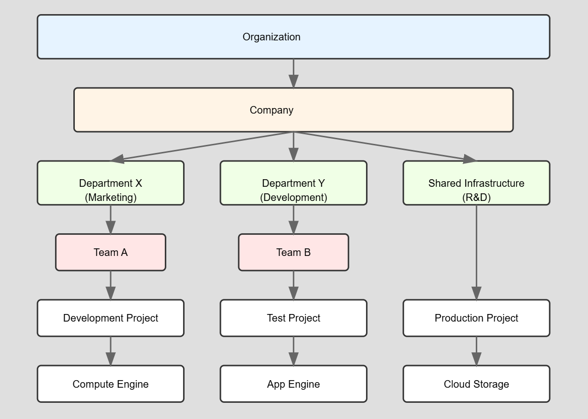

### **Notes on Basics of Cloud Computing**  

#### **Background: Traditional IT Infrastructure (1990s - 2000s)**  
Before cloud computing, businesses had to set up their own IT infrastructure, including:  
- **Servers**: Physical machines to store and process data.  
- **Storage**: Hard drives, storage devices to keep increasing amounts of data.  
- **Networking**: Switches, routers, firewalls, and load balancers to manage traffic.  
- **IT Administrators**: Required to manage the system (Linux Admin, Windows Admin).  
- **Huge Upfront Investment**: Businesses had to buy hardware, storage, and networking equipment, which required significant investment.  

#### **Example: Growth of Storage Needs**  
- In earlier times, storage devices had limited capacity:  
  - **Micro SD cards**: 1GB, 2GB, 4GB  
  - **Hard Drives**: 512MB, 1TB, 2TB  
  - **Business Servers**: Needed to expand their storage as data increased.  
- Example: **Facebook & Flipkart Servers**  
  - Facebook’s servers store **huge amounts of data** (e.g., 2TB per server).  
  - Flipkart also needed massive storage for product databases.  

#### **Problems with Traditional IT Setup**  
1. **Scalability Issues**: Businesses had to predict their future needs and invest upfront in servers and storage.  
2. **Maintenance Costs**: Required IT staff for managing and upgrading hardware.  
3. **Hardware Failures**: Risk of data loss or downtime due to physical damage.  
4. **High Costs**: Businesses had to invest in infrastructure whether they used it fully or not.  

#### **Transition to Cloud Computing**  
- Instead of **owning** hardware and storage, businesses can **rent** computing power and storage from cloud providers.  
- Cloud computing enables:  
  1. **Pay-as-you-go Model**: Pay only for the resources used.  
  2. **Scalability**: Easily increase or decrease storage and computing power.  
  3. **Remote Access**: Access data and applications from anywhere.  
  4. **Reduced IT Management**: No need to maintain physical servers.  

#### **Real-World Example**  
- **Facebook**: Uses cloud-based solutions to store and process billions of images and videos.  
- **Flipkart**: Uses cloud servers to handle high traffic during sales events.  

#### **Conclusion**  
Cloud computing **eliminates the need for large upfront investments**, allows businesses to **scale easily**, and provides **on-demand access** to computing resources, making it an essential part of modern IT infrastructure.

Here's a structured explanation based on the image content, formatted in a clear, book-style manner.

---

# **Cloud Computing and Virtualization**

## **1. Introduction to Cloud Computing**
Cloud computing is the delivery of computing services, including servers, storage, databases, networking, and software, over the Internet. This eliminates the need for businesses to own and maintain physical infrastructure, allowing them to scale resources dynamically.

### **Characteristics of Cloud Computing**
1. **On-Demand Self-Service** – Users can provision computing resources as needed.
2. **Broad Network Access** – Services are available over the Internet and can be accessed remotely.
3. **Resource Pooling** – Multiple customers share resources dynamically allocated as needed.
4. **Rapid Elasticity** – Resources can be scaled up or down based on demand.
5. **Measured Service** – Users are billed based on their resource consumption.

---

## **2. Traditional IT Infrastructure vs. Cloud Computing**
Before cloud computing, businesses relied on **physical servers** for hosting applications and storing data.

### **Components of a Traditional IT Setup**
- **Physical Server** – A dedicated machine with **200GB RAM** and **1TB HDD** storage.
- **Operating System (OS)** – Typically, Windows Server 2019, Linux, or macOS.
- **Web Server** – IIS (Internet Information Services) for hosting websites.
- **Storage** – Local hard drives, SD cards, and external storage options.

### **Challenges of Traditional IT**
1. **High Upfront Cost** – Businesses needed to invest in expensive hardware.
2. **Limited Scalability** – Adding more resources required purchasing and installing new hardware.
3. **Maintenance and Management** – IT teams were required to manage servers, security, and performance.
4. **Risk of Downtime** – If hardware failed, data loss and service downtime could occur.

---

## **3. Virtualization in Cloud Computing**
Virtualization is the key technology that enables cloud computing. It allows a single physical server to run multiple **Virtual Machines (VMs)**, each acting as an independent server.

### **Key Concepts in Virtualization**
- **Hypervisor** – A software layer that enables virtualization by dividing a physical server into multiple virtual machines (VMs).
- **Virtual Machines (VMs)** – Software-based emulation of physical servers.
- **Resource Allocation** – Physical resources like RAM, CPU, and storage are divided among VMs.

### **Example Virtualization Setup**
- A physical server with **200GB RAM** and **1TB HDD**.
- The hypervisor creates multiple VMs:
  - **VM1** – 80GB allocated.
  - **VM2** – 20GB allocated.
  - **VM3** – 20GB allocated.
  - **VM4** – 12GB allocated.
- A total of **50 VMs** can be created from a single powerful server.

---

## **4. Cloud Computing in Action**
### **Use Case: Hosting Websites on Cloud Servers**
- A website (e.g., `www.technicalguftgu.in`) is hosted on a **cloud-based virtual server**.
- The website requires **32GB RAM** for smooth performance.
- Instead of using a single physical server, the cloud platform dynamically allocates resources based on traffic.

### **Comparison: Traditional vs. Cloud-Based Hosting**
| Factor | Traditional Hosting | Cloud Hosting |
|--------|--------------------|--------------|
| Infrastructure | Physical servers with fixed resources | Virtualized servers with scalable resources |
| Cost | High upfront investment | Pay-as-you-go model |
| Scalability | Limited | Highly scalable |
| Maintenance | Requires IT management | Managed by cloud providers |

---

## **5. Benefits of Cloud Computing**
1. **Cost Efficiency** – Pay only for what you use.
2. **Scalability** – Easily increase or decrease resources.
3. **Accessibility** – Work from anywhere with an Internet connection.
4. **Reliability** – Cloud providers ensure high uptime and backup solutions.
5. **Security** – Advanced security measures, including firewalls and encryption.

---

## **Conclusion**
Cloud computing has transformed the IT industry by making computing resources more flexible, scalable, and cost-effective. Virtualization plays a crucial role in enabling cloud environments by efficiently utilizing hardware resources. Businesses today leverage cloud computing to improve efficiency, reduce costs, and enhance accessibility.

---
lecture explains **IaaS, PaaS, and SaaS** in cloud computing.

---

### **1. Understanding Cloud Service Models**
Cloud computing is categorized into three primary models:

- **IaaS (Infrastructure as a Service)**
- **PaaS (Platform as a Service)**
- **SaaS (Software as a Service)**

Each model provides different levels of control, flexibility, and management for users.

---

### **2. Infrastructure as a Service (IaaS)**
**Definition:** IaaS provides virtualized computing resources over the internet, including **networking, storage, servers, and virtualization**.

**Key Features:**
- Users manage the **OS, middleware, runtime, and applications**.
- The cloud provider manages **virtualization, storage, servers, and networking**.

**Examples:**
- **Amazon EC2 (Elastic Compute Cloud)**
- **Google Cloud Compute Engine**
- **Microsoft Azure Virtual Machines**

---

### **3. Platform as a Service (PaaS)**
**Definition:** PaaS offers a platform that includes **runtime, middleware, and OS**, allowing developers to build, deploy, and manage applications without worrying about infrastructure.

**Key Features:**
- Users manage the **application**.
- The cloud provider manages **OS, middleware, runtime, virtualization, storage, servers, and networking**.

**Examples:**
- **Google App Engine**
- **AWS Elastic Beanstalk**
- **Microsoft Azure App Services**

---

### **4. Software as a Service (SaaS)**
**Definition:** SaaS provides ready-to-use software applications over the internet, eliminating the need for installation, maintenance, or management of infrastructure.

**Key Features:**
- The cloud provider manages **everything**, including applications, runtime, middleware, OS, virtualization, storage, servers, and networking.
- Users just access the application via a web browser.

**Examples:**
- **Google Drive**
- **Google Workspace (Google Docs, Sheets, Slides)**
- **Gmail**
- **Microsoft Office 365**

---

### **5. Real-World Analogies**
- **College Analogy:** 
  - Infrastructure = **Benches, whiteboards, computers**.
  - Platform = **Teachers, administration**.
  - Software = **Books, notes**.

- **Hospital Analogy:**
  - Infrastructure = **ICU, beds, equipment**.
  - Platform = **Doctors, medical tools**.
  - Software = **Surgeries, medicine**.

---

### **6. Key Takeaways**
| Feature  | IaaS | PaaS | SaaS |
|----------|------|------|------|
| **User Manages** | OS, Middleware, Runtime, Applications | Application | Nothing |
| **Provider Manages** | Virtualization, Storage, Servers, Networking | OS, Middleware, Runtime, Virtualization, Storage, Servers, Networking | Everything |
| **Examples** | AWS EC2, Google Compute Engine | Google App Engine, AWS Elastic Beanstalk | Gmail, Google Drive |

---
### Types of Cloud

1. **Public Cloud**
   - **Definition**: Any individual or organization can access and use this cloud via the internet globally.
   - **Examples**: 
     - Microsoft Azure
     - Amazon Web Services (AWS)
     - Google Cloud Platform
     - Oracle Cloud
     - IBM Cloud

2. **Private Cloud**
   - **Definition**: Designed for a single organization, offering enhanced security and control.
   - **Key Points**:
     - More expensive than public clouds due to dedicated resources.
     - Customizable according to an organization’s specific needs.
     - Suitable for businesses with stringent regulatory or security requirements.

3. **Hybrid Cloud**
   - **Definition**: Combination of both public and private clouds, allowing data and applications to be shared between them.
   - **Benefits**:
     - Flexibility in workload management.
     - Enhanced security for sensitive data.
     - Cost efficiency by leveraging public resources for less-critical operations.

4. **Community Cloud**
   - **Definition**: Shared infrastructure for a specific community of users with common concerns.
   - **Key Points**:
     - Cost-effective as resources are shared.
     - Tailored to meet the shared requirements of the community.

---
### **1. Understanding Cloud Regions and Zones**
Cloud providers like AWS, Google Cloud, and Azure structure their global infrastructure using **Regions, Zones, and Multi-Regions** to ensure **high availability, scalability, and disaster recovery**.

- **Region:** A **geographical area** that contains multiple **availability zones** (data centers).
- **Zone:** An **isolated data center** within a region.
- **Multi-Region:** A **distributed setup** across different regions for global availability.

---

### **2. Key Concepts from the Whiteboard**
1. **Regions in Different Continents:**
   - **US:** Iowa, Toronto, Ashburn.
   - **Europe:** London, Frankfurt.
   - **Asia-Pacific:** Mumbai, Delhi.

2. **Zones Within a Region:**
   - Each region has multiple zones (e.g., Zone-a, Zone-b, Zone-c).
   - Zones are physically separate data centers but connected through high-speed networking.

3. **High Availability & Live Migration:**
   - **24x7x365 uptime** ensures services run continuously.
   - **Live Migration:** Moving virtual machines (VMs) between zones or regions without downtime.
   - **Example:** Mumbai region has multiple zones to distribute workloads and ensure fault tolerance.

4. **Physical Data Centers and Backend:**
   - **Backend infrastructure** is housed in physical data centers.
   - Each zone within a region has its own servers and networking.

---

### **3. Why Multi-Region Matters?**
- **Disaster Recovery:** If one region fails, another can take over.
- **Low Latency:** Users are served from the closest region.
- **Scalability:** Applications can expand globally.

---

| Concept  | Definition |
|----------|-----------|
| **Region** | A geographical location with multiple zones. |
| **Zone** | An isolated data center within a region. |
| **Multi-Region** | Services distributed across multiple regions. |
| **Live Migration** | Moving VMs between zones without downtime. |
| **High Availability** | Ensuring 24x7x365 uptime. |

###  **Core Concepts**

- **Regions**: Independent geographic areas containing multiple zones 5:18
- **Zones**: Deployment areas within regions for Google Cloud resources
- **Resource Types**: 
  - Zonal (VMs, Disks)
  - Regional (Subnets, Addresses)
  - Global (Images, VPC Networks)

###  **Resource Organization**

- **Resource Hierarchy** 5:8:
  - Organization → Projects → Resources
  - Each resource belongs to exactly one project

- **Zone Naming**: `<region><zone>` format (e.g., `us-central1-a`)

###  **Multi-Regional Services**

- **Purpose**: Maintain functionality even if one region fails
- **Key Regions**: US, Europe, Asia-Pacific
- **Supported Services**:
  - BigQuery
  - Bigtable
  - Cloud Storage
  - Spanner
  - Datastore
  - Firestore
  - Artifact Registry

- **High Availability**:
  - Deploy across multiple zones
  - Implement redundancy
  - Consider fault tolerance

- **Cost Considerations**:
  - Communication costs vary within/across regions
  - Plan for cross-region data transfer

- **System Design**:
  - Duplicate important systems across zones
  - Consider latency in deployment
  - Plan for unexpected failures

**Important Notes**
- Single region failure only affects customers in that region
- Multi-region products maintain functionality during regional outages
- Zones are independent failure domains within regions

### **Google Cloud Resource Hierarchy**  

**Purpose:**  
- Ensures **ownership hierarchy**, binding the lifecycle of a resource to its immediate parent.  
- Provides **inheritance points** for **access control** and **organization policies**.  

---

**Hierarchy Structure (Top to Bottom):**  
1. **Organization**:  
   - Top level; manages **billing accounts**, **permissions**, and **policies** (highest priority).  
2. **Folders**:  
   - Group multiple projects; help apply policies at scale.  
3. **Projects**:  
   - Core entity for managing **resources**; linked to **one billing account**.  
   - Example: *My First Project*.  
4. **Resources**:  
   - Belong to **one project only**.  
   - Examples: **VM instances**, **Cloud Storage**, **Databases**, **APIs**.  

---

**Billing Structure:**  
- **Bottom-to-top** aggregation (resources → project → folder → organization).  
- Example costs: ₹100, ₹1000, ₹2000.  

---

**Key Concepts:**  
- Resembles a **file system hierarchy**:  
  - Example: `/organization/folder/project/resource`  
  - Similar to OS structure: `/home/user/documents/...`  
- **Access & policies** automatically inherited down the hierarchy unless overridden.  

---

**Additional Points:**  
- Each **resource** has **one parent**.  
- **High availability** ensured through **live migration** and **multi-region deployment**.  
- **Regions** contain multiple **zones** for redundancy and fault tolerance.  

---

* **Project ID:** This is a unique identifier for your project across all of Google Cloud.
* **Project Name:** This is a name you choose for your project. It doesn't have to be unique.
* **Project Number:** This is a unique 12-digit number automatically assigned to your project by Google Cloud.

| Component      | Description                               | Chosen By | Mutable/Immutable |
|-----------------|-------------------------------------------|-----------|-------------------|
| Project ID      | Globally Unique                          | You       | Immutable         |
| Project Name    | Uniqueness Not Required                  | You       | Mutable           |
| Project Number  | Globally Unique, Assigned 12-digit number | GCP       | Immutable         |

**PROJECTS**

→ All GCP resources you use are associated
   to one specific project

→ You can track resources and quota usage

→ Enable billing and set budget

→ Manage permissions and credentials

→ Project is a global entity

→ Enable services and APIs

→ Equivalent to "account" in AWS and
   "subscription" in Microsoft Azure