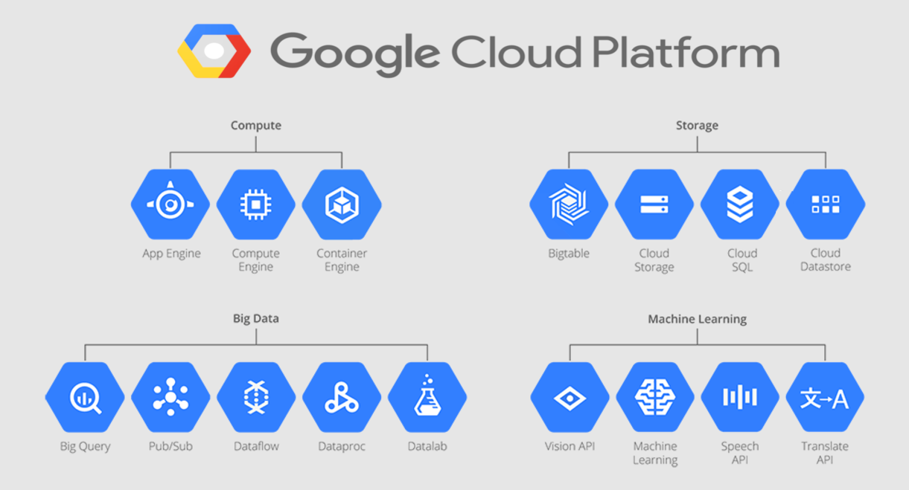
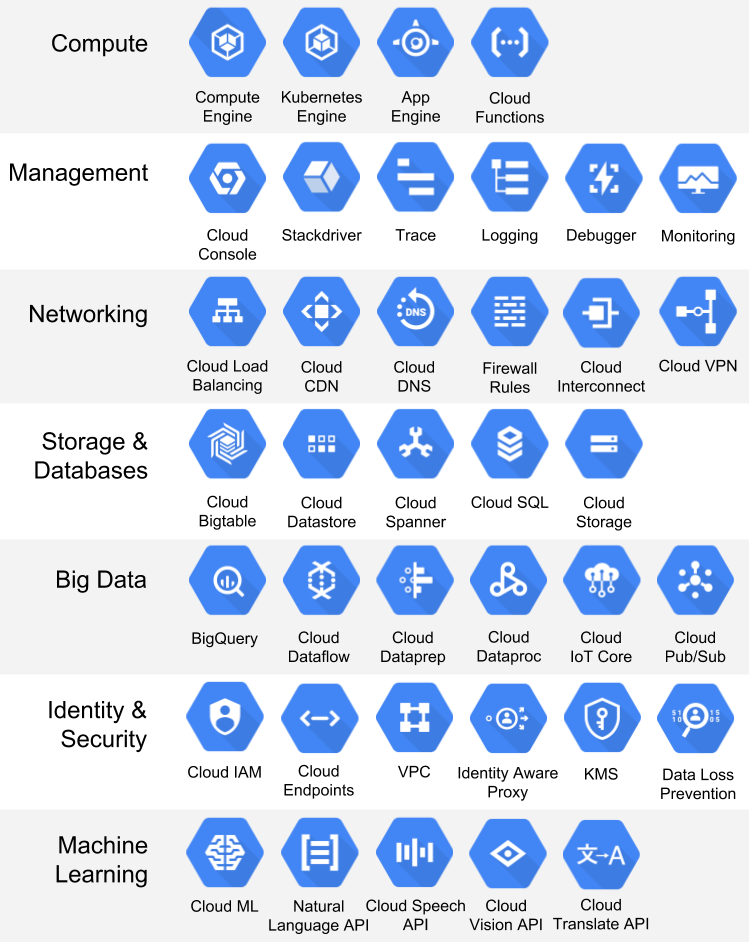

## **1. Compute Resources:**

#### **a) Google Compute Engine (GCE)**  
- **Virtual Machines (VMs)**: On-demand computing instances, running Linux or Windows.
- **Scalable**: Easily scale up or down based on workload demands.
- **Use cases**: Websites, applications, high-performance computing.

#### **b) Google Kubernetes Engine (GKE)**  
- **Managed Kubernetes**: Orchestrates containerized applications on a cluster of VMs.
- **Auto-scaling**: Automatically adjusts based on traffic demands.
- **Use cases**: Containerized applications, microservices architecture.

#### **c) App Engine**  
- **Platform-as-a-Service (PaaS)**: Automatically handles infrastructure management for your web applications.
- **Supports multiple languages**: Python, Java, Go, Node.js, etc.
- **Use cases**: Web apps, mobile backend services.

#### **d) Cloud Functions**  
- **Serverless Compute**: Execute functions triggered by events.
- **Automatic scaling**: Scales based on the event load.
- **Use cases**: Microservices, lightweight API backend.

---

### **2. Storage Resources:**

#### **a) Google Cloud Storage**  
- **Object Storage**: Scalable storage for unstructured data (images, videos, backups).
- **Multiple classes**: Standard, Nearline, Coldline for cost-efficient storage.
- **Use cases**: Data backups, media storage, static website hosting.

#### **b) Cloud SQL**  
- **Managed Relational Database**: Supports MySQL, PostgreSQL, and SQL Server.
- **Automatic backups**: Managed backups and scaling.
- **Use cases**: Websites, applications needing structured data storage.

#### **c) Cloud Spanner**  
- **Globally Distributed Database**: Horizontal scaling for mission-critical applications.
- **Multi-region support**: Automatic replication and data consistency.
- **Use cases**: Large-scale applications needing high availability and low latency.

#### **d) Firestore & Firebase Realtime Database**  
- **NoSQL Databases**: Scalable and flexible databases for mobile and web apps.
- **Real-time sync**: Data syncs in real-time across clients.
- **Use cases**: Mobile apps, real-time collaboration tools.

---

### **3. Networking Resources:**

#### **a) Virtual Private Cloud (VPC)**  
- **Private Network**: Customizable private network within GCP.
- **Subnets**: Create isolated subnets for different types of workloads.
- **Use cases**: Secure communication between services, hybrid cloud solutions.

#### **b) Cloud Load Balancing**  
- **Global Load Balancer**: Distribute traffic across multiple regions for high availability.
- **Auto-scaling**: Scales based on incoming traffic.
- **Use cases**: High-traffic websites, global applications.

#### **c) Cloud CDN**  
- **Content Delivery Network**: Cache content closer to users for faster delivery.
- **Global Reach**: Leverages Google's global edge locations.
- **Use cases**: Static content delivery, media streaming.

#### **d) Cloud DNS**  
- **Managed DNS**: Reliable, low-latency domain name system service.
- **Auto-scaling**: Handles large amounts of DNS queries.
- **Use cases**: Website domain management, high-availability applications.

---

### **4. Machine Learning and AI:**

#### **a) AI Platform**  
- **Machine Learning Services**: Train and deploy machine learning models at scale.
- **Pre-built APIs**: Use pre-trained models for vision, speech, language, and more.
- **Use cases**: Chatbots, image recognition, sentiment analysis.

#### **b) TensorFlow on Google Cloud**  
- **Deep Learning Framework**: Easily deploy TensorFlow models with Google’s AI tools.
- **Scalable Infrastructure**: Utilize GPUs and TPUs for training and inference.
- **Use cases**: Research, AI-powered applications.

---

### **5. Identity & Security Resources:**

#### **a) Identity and Access Management (IAM)**  
- **Access Control**: Define who has access to which resources with roles and policies.
- **Granular Permissions**: Fine-grained control over users and service accounts.
- **Use cases**: Securely manage access to cloud resources.

#### **b) Cloud Security Command Center**  
- **Security Insights**: View vulnerabilities and threats across your GCP environment.
- **Compliance**: Helps with regulatory compliance and audits.
- **Use cases**: Risk assessment, security monitoring.

#### **c) Cloud Key Management (KMS)**  
- **Managed Encryption**: Store and manage cryptographic keys for your applications.
- **Automated Key Rotation**: Automatically rotate keys for better security.
- **Use cases**: Data encryption, compliance.

---

### **6. Big Data & Analytics:**

#### **a) BigQuery**  
- **Serverless Data Warehouse**: Analyze massive datasets in real time.
- **Scalable & Fast**: Handles petabytes of data quickly and cost-effectively.
- **Use cases**: Data analytics, business intelligence, real-time insights.

#### **b) Dataflow**  
- **Stream & Batch Processing**: Process real-time data streams or batch data.
- **Serverless**: Automatically scales to handle data processing workloads.
- **Use cases**: ETL processes, real-time analytics.

#### **c) Pub/Sub**  
- **Message Queuing**: Reliable, scalable messaging system for event-driven applications.
- **Real-time Processing**: Instant data flow and event distribution.
- **Use cases**: Event-driven systems, real-time data streaming.

---

### **7. Developer Tools:**

#### **a) Cloud SDK**  
- **Command-line Interface**: Tools for managing GCP resources from your terminal.
- **API Interactions**: Integrate and automate tasks using scripts.
- **Use cases**: Automation, deployment, and resource management.

#### **b) Cloud Build**  
- **Continuous Integration & Deployment**: Build and deploy applications automatically.
- **Scalable**: Supports multiple environments like Kubernetes and App Engine.
- **Use cases**: DevOps workflows, CI/CD pipelines.

#### **c) Cloud Source Repositories**  
- **Git-based Repositories**: Private Git repositories for your code.
- **Integrated with GCP**: Built-in access to other GCP services for seamless workflows.
- **Use cases**: Source code management, version control.

---

### **8. Management & Monitoring:**

#### **a) Stackdriver (Cloud Operations Suite)**  
- **Monitoring & Logging**: Collect logs and monitor the health of your applications and infrastructure.
- **Alerts**: Set up automated alerts to notify you of system issues.
- **Use cases**: Performance monitoring, logging, troubleshooting.

#### **b) Cloud Trace**  
- **Distributed Tracing**: Analyze and optimize latency in applications.
- **Real-time**: Trace requests across various services and track bottlenecks.
- **Use cases**: Performance optimization, latency reduction.

#### **c) Cloud Deployment Manager**  
- **Infrastructure as Code**: Manage GCP resources using configuration files.
- **Automated Deployment**: Deploy resources consistently across environments.
- **Use cases**: Infrastructure provisioning, automation.

---
