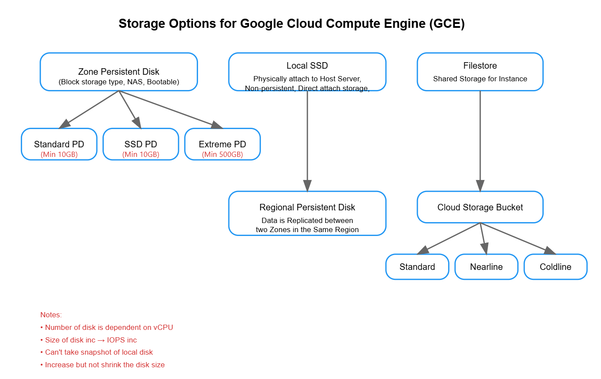

## **Compute Engine**

Compute Engine is a customizable compute service that lets you create and run virtual machines on Google's infrastructure.

**Types of Machines in GCP**

| Type                | Description                                                                                           |
|---------------------|-------------------------------------------------------------------------------------------------------|
| **Custom Machines** | You can select the VCPU and memory as per your needs and create your own custom machine.              |
| **Predefined Machines** | Predefined machine types are pre-built and ready to go with specific amounts of VCPU and memory to start running apps quickly. |


**Key Points:**

*   Google Compute Engine comes under IaaS (Infrastructure as a Service).
*   A virtual machine is like a physical hardware server but running in the cloud.
*   GCP isolates resources and sells them on a per-server basis with different combinations.
*   Google provides VMs of all sizes, from micro to 160 vCPUs and 3.75 TB of memory.


### Core Infrastructure Components

Google Compute Engine uses the open-source KVM (Kernel-Based Virtual Machine) as its hypervisor, while Azure Virtual Machines utilize Hyper-V.

### Storage Capabilities

Google Compute Engine offers two types of storage: Local SSD Storage and Persistent Disk Storage. Local SSD Storage has a maximum capacity of up to 3TB and is fully encrypted. Persistent Disk Storage, on the other hand, has a maximum capacity of up to 64TB, a minimum size of 375GB, and is also fully encrypted.

### Performance Characteristics

Google Compute Engine is known for its leading boot speed among cloud providers.

### Billing Structure

Google Compute Engine charges for resources based on usage. vCPU and memory (GB) are charged with a minimum of 1 minute, and after the initial minute, the charges are calculated in 1-second increments.


---

## Google Cloud Compute Engine (GCE) or Virtual Machines

### 1. Types of Pre-defined VM / Machine Families
- **General Purpose**  
- **Compute Optimized**  
- **Memory Optimized**  
- **Accelerator Optimized (GPU)**  
- **Shared Core**  
- **Sole-Tenant Node**  

### 2. Machine Family
- Each **machine family** has a specific set of processor and hardware configurations.
- Machine families are further classified by **Series** and **Generation**.

### 3. Machine Type
- A **machine type** is a set of virtualized hardware resources (e.g., system memory size, vCPU, and persistent disk) available to a virtual machine.
- In Compute Engine, machine types are grouped into families based on their behavior and workload.
- Each **machine series** has predefined machine types according to memory size, vCPUs, and other resources.

### 4. Customers Using GCE
- PayPal  
- Twitter  
- P&G  
- Airbus  
- Etsy  
- (and many more)

---

| **Workload Category**     | **Machine Family (Series)**           | **Description**                                                                                           | **Example Use Cases**                                                                                                      |
|---------------------------|----------------------------------------|-----------------------------------------------------------------------------------------------------------|-----------------------------------------------------------------------------------------------------------------------------|
| **General Purpose**       | **Cost-Optimized** (E2)               | - Day-to-day computing at a lower cost                                                                    | - Web Serving<br>- Back Office Apps<br>- App Serving<br>- Basic Dev/Test<br>- Microservices<br>- Virtual Desktops           |
| **General Purpose**       | **Balanced** (N1, N2, N2D)            | - Balanced price/performance across a wide range of VM shapes                                            | - Web Serving<br>- Back Office Apps<br>- App Serving<br>- Basic Dev/Test<br>- Databases<br>- Cache<br>- Media/Streaming     |
| **General Purpose**       | **Scale-Out Optimized** (Tau T2D)     | - Best performance/cost ratio for scale-out workloads                                                    | - Web Serving<br>- Scale-Out Web Services<br>- Containerized Microservices<br>- Large Java Applications                     |
| **Optimized Workloads**   | **Memory Optimized** (M1, M2)         | - Ultra-high memory for memory-intensive workloads across various industries                              | - Medium/Large In-Memory Databases (e.g., SAP HANA)<br>- Large In-Memory Analytics<br>- Microsoft SQL Server & Similar DBs  |
| **Optimized Workloads**   | **Compute Optimized** (C2)            | - Ultra-high performance for compute-intensive workloads                                                 | - Compute-Bound Workloads<br>- High-Performance Web Serving<br>- Gaming<br>- High-Performance Computing<br>- Media Transcoding |
| **Optimized Workloads**   | **Accelerator Optimized** (A2)        | - Best performance for highly parallelized computing (GPU, HPC, ML, AI)                                  | - CUDA ML Training<br>- HPC<br>- Massive Parallelization<br>- Computational Math<br>- Deep Learning                         |

---

1. **General Purpose Machine Families** focus on broad workloads with cost-effective, balanced, or scale-out performance.  
2. **Optimized Machine Families** specialize in memory-intensive, compute-intensive, or accelerator-driven (GPU/ML) tasks.  
3. **Machine Types** within each family define the exact resource configuration (vCPUs, memory, accelerators).


---

### **Specialized VM Types in Google Cloud Compute Engine (GCE)**  

### **1. Shared Core Machine Types**  
- Designed for **timesharing** the physical core.  
- **Cost-effective** option for small or batch workloads that need to run for a short time.  
- Uses **partial vCPU**, running on **one hyper-thread** of the host CPU.  

### **2. Sole-Tenant Nodes**  
- **Dedicated servers** for Compute Engine that prioritize a single user's workloads.  
- Primarily used for **BYOL (Bring Your Own License) applications**.  
- Provides access to **VM configurations and machine types** similar to regular Compute instances.  

---
### **Custom Machine Type**  

- If none of the predefined machine types match your needs, you can independently specify the **number of CPUs** and the **amount of memory** for your instance.  
- The **memory per vCPU** of a custom machine type must be between **0.9 GB, 3.75 GB, and 6.5 GB per vCPU**.  
- **Total memory** for a custom machine type must be a **multiple of 256 MB**.  
- If the **vCPU count** is **greater than 1**, it must be **even** (e.g., **2, 4, 6, 8, 10, etc.**).  

---


## **GCE - Compute Engine Pricing**  

### **1. Pricing Models**  
- **Sustained Use Discount**  
- **Committed Use Discount**  
- **On-Demand Pricing**  

### **2. Discounts**  
- **Committed Use Discount**:  
  - Up to **70% - 91%** discount.  
  - Requires a **3-year commitment**.  

- **Preemptible VM / Spot VM (Spot Instance)**:  
  - Offers significant cost savings.  
  - Suitable for fault-tolerant and batch workloads.  

### **3. Specialized VM Options**  
- **Sole-Tenant Nodes**  
- **Dedicated Hosts**  

---


### GCE Sustained Use Discounts

*   Sustained Use discounts are applied automatically to usage within a project, separately for each region. No action is required to enable them.
*   If you run a VM for more than 25% of a month, you are eligible for a discount between 20-30%.
*   The discount is given on vCPU and Memory usage.
*   For general-purpose N2 and N2D and Custom machine types, and for Compute Optimized machine types, you can receive a discount of up to 20%.
*   For general-purpose N1 predefined and Custom machine types, Sole-tenant nodes, and GPUs, you can get a discount of up to 30%.

### Limitations

*   Sustained use discounts automatically apply to VMs created by GCE or GKE.
*   Sustained Use discounts do *not* apply to VMs created using the App Engine environment and Dataflow.
*   Sustained use discounts do *not* apply to E2, A2, or Tau T2D machine types.


### Committed Use Discounts

**Ideal for workloads with predictable resource needs.**

*   When you purchase a Committed Use Contract, you purchase Compute Engine resources (such as vCPUs, memory, GPUs, local SSDs, and Sole-tenant nodes) at a discounted price in return for committing to paying for those resources for 1 to 3 years.

*   Discount is up to 57% to 70%.

*   After purchase, you are billed monthly, whether you are using the resources or not.

*   No upfront cost is required.

### How Committed Use Discounts Work

For example, if you purchase a Commitment for 18 Cores and you run 24 Cores during the month, you will receive the Committed Use discount for 18 Cores. The other 6 Cores will be billed at standard, non-Committed use rates.

**Note:** Keep in mind that after you purchase a set amount of Commitments, you are billed for those Commitments monthly, even if you don't use them.

→ You can't combine Committed Use discounts and Sustained Use discounts for the same resources.


### Committed Use Discounts - Limitations

*   Projects that are in the free tier period with free tier credits, and projects that do not have any payment history do not qualify for Committed Use discounts.

*   Committed Use discounts apply to usage in the project or Cloud Billing account in which those discounts are purchased.

*   Committed Use discounts do not apply to preemptible VM instances.

→ If a reservation is attached to a Committed Use discount, the reservation can't be deleted for the duration of the commitment.


### Preemptible Instances (GCE)

**(Test) / Never use in production**

Preemptible instances are available at a much lower price - 60-91% discount - compared to the price of Standard VMs.

However, Google Cloud might stop these instances if it needs to reclaim the compute capacity for allocation to other VMs.

*   Compute Engine always stops preemptible instances after they run for 24 hours.

*   The GCP Free Tier for Compute Engine does not apply to preemptible instances.

→ Preemptible instances cannot live migrate to a regular VM instance or vice-versa.

→ Not covered under SLA.

GCP gives only 30 seconds before reclaiming it.

Best suited for batch processing jobs of short duration.


## GCE - Storage Options for Compute Engine

**(Block storage type, NAS, Object storage)**

### Zone Persistent Disk

*   **Standard PD (HDD):** (Min 10 GB)
*   **Balanced PD (SSD):** (Min 10 GB)
*   **SSD PD:** (Min 10 GB)
*   **Extreme PD (SSD):** (Min 5000 GB)

### Local SSD

*   Physically attached to the host server, non-persistent.
*   Direct attach storage, not bootable.

### Regional Persistent Disk

*   Data is replicated between two zones in the same region.
*   Block storage type, bootable disk.

### Filestore

*   Shared storage for instances.

### Cloud Storage Bucket

*   Standard Storage
*   Nearline
*   Coldline
*   Archive

**Key Considerations:**

*   You can increase but not shrink the disk size.
*   The number of disks is dependent on the CPU.
*   Size increase leads to IOPS increase.
*   You can't take snapshots of local disks.




### Changing the Machine Type of a VM Instance

1. **Purpose of Changing Machine Type**
   - If the existing machine is not suitable for the workloads, change the machine type.

2. **Conditions for Changing Machine Type**
   - **No Local SSD & Not Part of MIG**: 
     - If the VM doesn’t have a local SSD and is not part of a Managed Instance Group (MIG), the machine type can be changed after stopping the VM.
   - **With Local SSD**:
     - If the VM has a local SSD, it cannot be stopped to change the machine type without forcing it to stop, which will result in data loss on the local SSD.

3. **Important Guidelines**
   - **Stopped VM Only**: 
     - The machine type can only be changed for a stopped VM, not for a running VM.
   - **Snapshots**:
     - Always take a snapshot before updating the VM size.
  
4. **Resources Not Affected by Changing Machine Type**
   - For VMs without a local SSD and not part of a MIG:
     - The following resources remain unaffected:
       - a) **The VM’s SSH Keys**
       - b) **The VM Configuration** (such as metadata)
       - c) **Persistent Disk Data** (including installed applications and app data)

5. **Considerations**
   - Changing the machine type may affect **Sustained Use Discounts** for the VM.

---
Here is a well-structured version of your notes:

---

# **Resizing Persistent Disks in GCP**  

### **Key Points:**  
- You can **increase** the size of a Persistent Disk when your VM instance requires **more storage or higher performance limits**.  
- **Disk size can only be increased**; **reducing** the disk size is **not allowed**.  
- VMs using **public images** **automatically resize the boot disk**, but for custom images or non-boot disks, **manual resizing is required**.  
- **No need to stop the VM** to resize the disk.  
- **Increasing disk size also increases IOPS** (Input/Output Operations Per Second).  

---

# **Resizing Persistent Disks in GCP**  

### **1. VM Instance**  
- A **virtual machine** with an attached **Persistent Disk (PD)**.  
- Example: **Initial disk size of 50GB**.  

### **2. Boot Volume (Persistent Disk)**  
- The **primary disk** from which the VM boots.  
- Can be resized when needed.  

### **3. Disk Size Increase**  
- Example: **Disk size increased from 99GB to a larger size**.  

### **4. IOPS Performance**  
- **Increasing disk size also boosts IOPS performance**.  

### **5. Snapshots (Backup Recommendation)**  
- **Taking a snapshot before resizing** is recommended to avoid data loss.  

### **6. Windows VM Example**  
- Displays a **Windows instance with partitions (C:, D:, E:)**.  

### **7. Linux VM Example**  
- Example: A Linux VM with a **10GB boot volume and an additional 99GB volume**.  

### **8. Attaching a Volume**  
- Demonstrates **adding an additional persistent disk** to an existing VM.  

### **9. Disk Space Allocation**  
- Shows **how disk space is divided** (e.g., **948GB total, 41GB free, 389GB used**).  

---
✅ **Disk resizing is supported without stopping the VM**.  
✅ **Disk size can be increased, but not decreased**.  
✅ **IOPS performance improves as disk size increases**.  
✅ **Snapshots are recommended before resizing**.  
✅ **Boot disks may require manual resizing depending on the OS image**.  

---

# **Resizing a Persistent Disk (Lec-14)**  

## **1. Resizing PD using Google Cloud Console**  

1. **Log in** to **GCP Console** → **Compute Engine** → **Create a VM** with a **10GB boot volume**.  
2. Navigate to **Disks** → Select the desired **disk** → Click **Edit**.  
3. Modify the **disk size** (e.g., **increase to 30GB**) → Click **Save**.  
4. **Access the VM via SSH** to modify the partition and filesystem.  
5. Verify the **updated storage size** in the **VM details page** (should now reflect **30GB**).  

---

## **2. Resizing a Persistent Disk using Cloud Shell**  

Use the following **gcloud command**:  

```bash
gcloud compute disks resize DISK_NAME --size=DISK_SIZE
```

Example:  

```bash
gcloud compute disks resize my-disk --size=30GB
```

---

## **3. Resizing a Persistent Disk in a Linux VM**  

After resizing the disk, you must extend the partition and filesystem:  

### **Step-by-Step Commands**  

1. **Check current disk usage:**  
   ```bash
   df -Th
   ```
2. **Switch to root user:**  
   ```bash
   sudo su
   ```
3. **Open disk partition tool:**  
   ```bash
   fdisk /dev/sda
   ```
4. **Identify the partition number** (e.g., `1`).  
5. **Resize the partition:**  
   ```bash
   resizepart /dev/sda 1
   ```
6. **Confirm the operation:**  
   - Type **Yes** when prompted.  
   - Accept **default values** for the **end sector** (e.g., `974? End 100%`).  
7. **Exit fdisk:**  
   ```bash
   quit
   ```
8. **Resize the filesystem:**  
   ```bash
   resize2fs /dev/sda1
   ```
   (Replace `/dev/sda1` with the actual partition if different.)  
9. **Verify the changes:**  
   ```bash
   df -Th
   ```

---

### **📌 Notes:**  
✅ **Disk size can be increased but not decreased.**  
✅ **Replace placeholders** (`DISK_NAME`, `DISK_SIZE`, `/dev/sda1`) with actual values.  
✅ **If resizing a boot disk**, additional steps might be required depending on the OS.  


### Images

You can use OS system images to create a boot disk for your instance. There are two types of images:

#### Public Image

Public images are provided and maintained by Google, Open Source Communities, and third-party vendors. All Google Cloud projects have access to these images by default and can create instances using them.

#### Custom Image

Custom images are specific to your Cloud project. You can create a custom image from a boot disk or other images and then use it to create an instance. Custom images are free to create but incur storage charges.

**(Diagram showing the relationship between VM instance (Linux/Windows), Boot Volume (disk), Software, Disk, Image, and Server)**

# Public Image and Custom Image

You can use custom images for the following purposes:

→ Copy one image to another project by using either the `gcloud` CLI or the API. You can also create an image from a custom image in a project.

→ Import a virtual disk to Compute Engine from your local workstation or from VMs running on your on-premises environment or on another cloud platform.

→ Create an image from the boot disk of your existing VM. Then, use that image to create new boot disks for your instances.


## Machine Image

→ A machine image is a Compute Engine resource that stores all the configuration, metadata, permissions, and data from multiple disks of a VM instance. You can use a machine image in many scenarios: system maintenance, backup and recovery, and instance cloning.

→ Machine images are suitable for creating backups of all disks that are attached to a VM instance.

→ Machine images can be used to clone instances. You can create multiple copies of an instance.

**Information stored in a Machine Image:**

*   Description
*   Machine type
*   Labels
*   Network tags
*   Maintenance policy
*   Instance metadata

Machine images are the most ideal resources for the following cases:

1.  Multiple disk backups
2.  Instance cloning

→ Machine images are stored in Cloud Storage buckets.

→ Regardless of where the machine image is stored, you can still access the machine image globally.

→ Machine images are unchangeable, but you can override a few properties.


# When to Use Which Image?

| SCENARIOS             | MACHINE IMAGE | PERSISTENT DISK SNAPSHOT | CUSTOM IMAGE | INSTANCE TEMPLATE |
|----------------------|---------------|--------------------------|--------------|-------------------|
| Single Disk Backup   | <span style="color:green;">YES</span>           | <span style="color:green;">YES</span>                      | <span style="color:green;">YES</span>          | <span style="color:red;">NO</span>                |
| Multiple Disk Backup | <span style="color:green;">YES</span>           | <span style="color:red;">NO</span>                       | <span style="color:red;">NO</span>           | <span style="color:red;">NO</span>                |
| Differential Backup  | <span style="color:green;">YES</span>           | <span style="color:green;">YES</span>                  | <span style="color:red;">NO</span>           | <span style="color:red;">NO</span>                |
| Instance Cloning    | <span style="color:green;">YES</span>           | <span style="color:red;">NO</span>                       | <span style="color:green;">YES</span>          | <span style="color:green;">YES</span>               |
| Base Image for Replication | <span style="color:red;">NO</span>            | <span style="color:red;">NO</span>                       | <span style="color:green;">YES</span>          | <span style="color:red;">NO</span>                |


---

### **Creating a VM Instance in Google Cloud Platform**  

#### **Prerequisites**  
- ✅ Active Google Cloud Platform project  
- ✅ Billing enabled  
- ✅ IAM permissions: `roles/compute.instanceAdmin.v1` (5:19)  

---

#### **Step-by-Step Process**  

**1. Access GCP Console**  
- Navigate to [Google Cloud Console](https://console.cloud.google.com)  
- Select your project from the project selector  

**2. Navigate to Compute Engine**  
- Click the ☰ **Navigation Menu** (top-left)  
- Go to **Compute Engine** → **VM instances**  
- Click **Create Instance**  

**3. Configure Basic Settings**  
| Field | Value |  
|-------|-------|  
| **Name** | Unique instance name (e.g., `prod-web-server-01`) |  
| **Region/Zone** | Select region (e.g., `us-central1`) and zone (e.g., `us-central1-a`) |  
| **Machine Type** | `n1-standard` series (e.g., `n1-standard-2` for 2 vCPUs) |  
| **Boot Disk** | Default OS: Debian (customize if needed) |  

**4. Configure Networking**  
- **Network Interface**: Default VPC  
- **External IP**: Set to **Ephemeral** (temporary public IP)  
- **Firewall Rules**: Check **Allow HTTP/HTTPS traffic**  

**5. Configure Security**  
- **Service Account**: Default Compute Engine service account  
- **SSH Keys**: Add keys for secure access (optional)  
- **Metadata**: Add key-value pairs (e.g., `env=prod`)  

**6. Review & Create**  
- Verify all settings  
- Click **Create**  
- Wait for green checkmark (✔️) indicating successful creation (6:2)  

---

### **Creating a Custom Image**  

#### **Step 1: Disable Auto-Delete for Source Disk**  
```bash
gcloud compute instances set-disk-auto-delete [VM_NAME] \
    --no-auto-delete \
    --disk=[SOURCE_DISK_NAME]
```

#### **Step 2: Create the Image**  
```bash
gcloud compute images create [IMAGE_NAME] \
    --source-disk=[SOURCE_DISK] \
    --source-disk-zone=[ZONE] \
    --storage-location=us \
    --force
```

#### **Step 3: Verify Image Creation**  
```bash
gcloud compute images describe [IMAGE_NAME]
```

---

### **Important Notes**  
1. The instance creator automatically gets the `roles/compute.instanceAdmin` role (6:2).  
2. **Pre-Connection Checks**:  
   - Verify instance status via `gcloud compute instances list`  
   - Check firewall rules if unable to connect  
3. **Machine Type Guidelines**:  
   - Use `n2-standard` for general workloads  
   - Use `e2-micro` for free-tier eligible instances  
4. **Production Best Practice**: Use **Managed Instance Groups (MIGs)** for auto-scaling.  

---

### **Cleanup**  
To avoid unnecessary charges:  
1. Go to **Compute Engine** → **VM Instances**  
2. Select target instance → Click 🗑️ **Delete**  
3. Confirm deletion (6:4)  

---

### **Key Takeaways**  
- Use ephemeral IPs for temporary workloads; reserve static IPs for production.  
- Custom images streamline deployment of pre-configured environments.  
- Always review IAM permissions before sharing instances.  


### Using the GCP Console (GUI)

1. **Open GCP Console**: Go to [Google Cloud Console](https://console.cloud.google.com).

2. **Create or Select a VM**: Navigate to **Compute Engine** > **VM instances**. If you need a new VM, click **Create Instance** and configure it.

3. **Go to Machine Images**: On the left menu, click on **Compute Engine** > **Machine images**.

4. **Create Machine Image**: Click the **Create Machine Image** button.

5. **Name Your Image**: Enter a unique name for the machine image (e.g., `mymachine-img`).

6. **Select Source VM**: Choose the VM instance (e.g., `instance-1`) from the dropdown.

7. **Choose Location**: Select **Regional** for redundancy, or a specific zone as needed.

8. **Create the Image**: Click the **Create** button to start the image creation process.

9. **Launch New Instance**: Once created, click on the machine image, then click **Create Instance** to create a new VM from this image.

10. **Test the Instance**: Connect to the new instance to verify its functionality.

---

#### Using Cloud Shell

1. **Open Cloud Shell**:
   - In the top right corner of the GCP Console, click on the **Activate Cloud Shell** icon (looks like a terminal window). This opens a command-line interface at the bottom of the console.

2. **Create the Machine Image**:
   - Use the following command to create a machine image. Replace `machine-image-name` with your desired image name, `vm-name` with the name of your existing VM, and specify the correct zone.

   ```bash
   gcloud compute machine-images create machine-image-name --source-instance=vm-name --source-instance-zone=us-central1-a
   ```

   - **Example**: If you want to create an image called `my-instance-image` from a VM named `instance-1` in the zone `us-central1-a`, the command would look like this:

   ```bash
   gcloud compute machine-images create my-instance-image --source-instance=instance-1 --source-instance-zone=us-central1-a
   ```

3. **Verify the Creation of the Machine Image**:
   - You can list all machine images to verify that your image has been created successfully:

   ```bash
   gcloud compute machine-images list
   ```

4. **Create a New Instance from the Machine Image**:
   - To create a new instance from the machine image, use the following command:

   ```bash
   gcloud compute instances create instance-name --machine-image=machine-image-name --zone=us-central1-a
   ```

   - **Example**: If you want to create a new instance called `new-instance` using `my-instance-image`, the command would look like this:

   ```bash
   gcloud compute instances create new-instance --machine-image=my-instance-image --zone=us-central1-a
   ```

5. **Test the New Instance**:
   - Similar to the console method, connect to your new instance and verify that it operates as expected.

