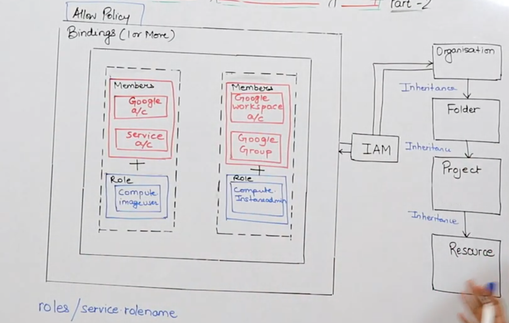
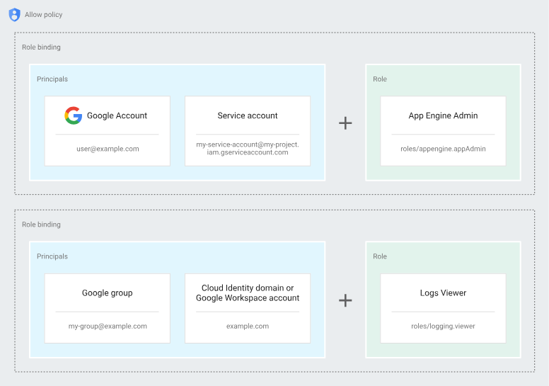

## **Identity and Access Management**

- IAM (Identity and Access Management) allows you to provide specific access to Google Cloud resources, giving you control over who can access what, while also ensuring that users cannot access resources they don’t need.

- IAM supports the security principle of least privilege, meaning that each user or entity is only granted the minimum permissions required to perform their job functions, reducing the risk of unnecessary access.

- With IAM, you manage access by specifying "who" (the identity, such as a user or service account) can perform "what" (the role or actions) on "which" resources (like storage, databases, or virtual machines).

- Instead of granting permissions directly to users, IAM groups permissions into roles, and these roles are assigned to authenticated principals (members). This approach makes it easier to manage access across many users.

- A policy in IAM defines and enforces which roles are granted to which principals (users, groups, or service accounts). Each policy is attached to a resource, specifying what access is allowed.

- When an authenticated principal (such as a user) attempts to access a resource, IAM evaluates the resource's policy to determine if the user’s assigned roles and permissions allow the requested action.

```sh
                        Policy
                    [Member + Role]

                      Identity Access Management
                          ↓             ↓           Resource
                 User/person       Role          Room
                 Visitor           - Office
                 New Joinee
                 Senior Developer → Datacenter
```

**Features of IAM**

- IAM allows you to authorize who can perform specific actions on resources, providing full control and visibility over your Google Cloud services in a centralized manner.
  
- Permissions are represented as **service.resource.verb**, which defines the type of action allowed on a specific resource.

- You can group users based on their job functions and assign them appropriate roles, streamlining the management of access.

- With IAM, users only receive the permissions they need to perform their tasks, ensuring security by minimizing unnecessary access.

- Cloud IAM allows you to grant access to Cloud resources at a granular level, going beyond just project-level access to more detailed, resource-specific permissions.

### IAM has three important components:

1. **Principal/Members**  
   A principal represents an entity that can be granted access to resources. It can be:
   - A Google account
   - A service account
   - A Google Group
   - A Google Workspace
   - A Cloud Identity domain
   - Authenticated users
   - All users

2. **Role**  
   A role is a set of permissions that define what operations can be performed on resources. When you assign a role to a principal, you give them all the permissions included in that role.

3. **Policy**  
   A policy is a collection of role bindings that associate principals with roles. To specify who has access to what resources, you create an allow policy and attach it to the resource, ensuring controlled access.

**IAM: Identity and Access Management - Part 2**

In IAM, access is granted to **principals**. Principals represent entities that can be assigned roles, and they can be one of the following types:

1. Google account
2. Service account
3. Google Group
4. Google Workspace account
5. Cloud Identity domain
6. All Authenticated Users
7. All Users

### Types of Principals:

- **Google account**:  
   A Google account can be any email address linked to a Google account, such as one with a **gmail.com** domain or any other domain associated with Google.

- **Service account**:  
   A service account is not tied to a specific individual, but rather to an application or automated process. It's used for server-to-server interactions or compute workloads that don’t require human intervention.

- **Google Group**:  
   A Google Group is a collection of Google accounts and service accounts. Each group has a unique email address, and you can grant or change access for the entire group rather than individually managing each member’s permissions. This makes it easier to manage access at scale.

- **Google Workspace account**:  
   A Google Workspace account is associated with an organization’s domain, such as **example.com**. When a new user is created in Google Workspace (for instance, a user with an email address like **name@example.com**), that account is automatically added to the organization's virtual group, simplifying administrative tasks.

By assigning roles to these principals, you can control who has access to various resources in Google Cloud.


**Cloud Identity Domain**  
A **Cloud Identity domain** is similar to a Google Workspace account because it represents a virtual group of all Google accounts within an organization. However, users in a Cloud Identity domain do not have access to the full range of Google Workspace applications and features.

**All Authenticated Users**  
The identifier **`allAuthenticatedUsers`** represents all users and service accounts that have authenticated with a Google account. This includes personal Gmail accounts and other accounts that are not tied to a Google Workspace or Cloud Identity domain. However, it does **not** include unauthenticated users or anonymous visitors.

**All Users**  
The identifier **`allUsers`** represents anyone on the internet, including both authenticated and unauthenticated users. This means it covers everyone, regardless of whether they are signed in with a Google account or not.

---

### **Roles in IAM:**

- **Basic**  
- **Predefined**  
- **Custom Role**  

A **role** in IAM is a collection of permissions that allow specific actions to be performed on Google Cloud resources. You do not grant permissions directly to users in IAM. Instead, you assign roles, which bundle multiple permissions together.

To give members, such as users, groups, or service accounts, the necessary permissions, you grant them roles. This allows you to efficiently manage access to resources based on the roles assigned, ensuring users only have the permissions required to perform their tasks.


There are three types of roles in Google Cloud IAM:

### ① **Basic/Primitive roles:**

IAM **Basic roles** offer fixed, coarse-grained levels of access, which can be applied at the project level. These roles are suitable for general use but lack fine-grained control.

| **Role**            | **Permissions**                                      |
|---------------------|------------------------------------------------------|
| **Owner**           | → Full control over all resources in the project, including adding/removing members and deleting/creating projects. |
|                     | → Super user access with project-level management.   |
|                     | → Setup billing for projects and manage access.      |
| **Editor**          | → Modify resources and deploy applications.          |
|                     | → Can edit code, deploy apps, and configure services. |
|                     | → Can start and stop services, but cannot manage billing. |
| **Viewer**          | → Read-only access to resources.                    |
|                     | → Can view resources but cannot make any modifications. |
| **Billing Admin**   | → Manage billing accounts and associated resources. |
|                     | → Can add or remove billing administrators but cannot modify project resources. |

---
**Roles** - Basic
        - Predefined
        - Custom Role

**Predefined Roles** - Service level

→ Provides granular access for a specific service and is managed and defined by Google Cloud.

→ Prevents unwanted access to other resources.

→ Google is responsible for updating and adding permissions as necessary.

→ You can grant multiple roles to the same user.


**Custom Roles**

→ Provide granular access according to a user-defined list of permissions.

→ You can create a custom IAM role with one or more permissions and then grant that custom role to users or groups.

→ Custom roles are not maintained by Google.

→ You can grant multiple roles to a user or a group.


**Policy**

→ A policy is a collection of bindings, audit configuration, and metadata.

→ A binding associates one or more members with a single role and any context-specific conditions that change how and when the role is granted.

→ Each binding includes the following fields:

→ A member, known as a principal, can be a:

    - User account
    - Service account
    - Google Group
    - Domain


→ A **role** which is named collection of permissions that grant access to perform actions on Google Cloud Resources.

→ A **condition**, which is a logical expression that further constrains the role binding based on attributes about the request, such as its origin, the target resource, etc.

**Definition**

You can grant roles to users by creating an allow policy, which is a collection of statements that define who has what type of access.

Policy → Principal + Role + Condition





# **Service Account**

→ A service account is a special kind of account used by an application or a virtual machine (VM), not a person.

→ Applications use service accounts to make authorized API calls, authorized as either:

   - the service account itself
   - as Google Workspace
   - as Cloud Identity users through domain-wide delegation.

→ A service account is identified by its email address, which is unique to the account.

   `saname@projectid.iam.gserviceaccount.com`


→ Each service account is associated with two sets of public/private RSA key pairs. Used to authenticate to Google.

**Types of Service accounts:**

① Default Service account

② User-managed Service accounts

→ A service account is also a resource with IAM policies attached to it, which means you can define who can use the account and who can perform specific actions on the service account.


Below is a **short cheat sheet** on GCP Cloud IAM followed by **5 detailed scenario-based questions** with multiple‑choice options and thorough explanations.

---

## GCP Cloud IAM Cheat Sheet

- **Definition:**  
  Cloud IAM (Identity and Access Management) lets you manage who (identity) has what access (roles/permissions) to which Google Cloud resources.

- **Key Components:**  
  - **Identities:** Users, groups, service accounts, and domains.  
  - **Roles:**  
    - **Basic roles:** Owner, Editor, Viewer (broad permissions).  
    - **Predefined roles:** Granular roles curated by Google for specific services (e.g., Storage Object Viewer).  
    - **Custom roles:** Tailored sets of permissions that you create to meet precise business needs.
  - **Permissions:** The individual actions (e.g., `storage.objects.get`) allowed by a role.
  - **Policies:** Bindings that link identities to roles on specific resources.
  - **Conditions:** Optional expressions to enforce context-based access (e.g., based on IP or time).

- **Best Practices:**  
  - Follow the **principle of least privilege**: Grant only the permissions required for a task.  
  - Use **custom roles** when predefined roles are too permissive.  
  - Regularly **audit IAM policies** using Cloud Audit Logs.  
  - Use **service accounts** for applications and assign them only the necessary roles.

---

## Detailed Google Cloud IAM Scenario-Based Questions

### **Question 1: Securing a Cloud Storage Bucket**

**Scenario:**  
Your team needs to give a developer read-only access to a specific Cloud Storage bucket that contains sensitive data. You must ensure the developer can view objects but cannot modify or delete any content.

**Which role should you assign to the developer for that bucket?**

A. Storage Admin  
B. Storage Object Creator  
C. Storage Object Viewer  
D. Editor

**Correct Answer:** C. **Storage Object Viewer**

**Explanation:**  
The **Storage Object Viewer** role grants read-only access to view objects in a Cloud Storage bucket. This role adheres to the principle of least privilege by providing only the permissions necessary to view content without the ability to create, modify, or delete objects. Roles like Storage Admin or Editor are overly permissive for this scenario.

---

### **Question 2: Creating Custom Roles for Granular Access**

**Scenario:**  
Your organization has multiple teams that need very specific permissions on various GCP resources. Predefined roles provide broader permissions than necessary, and you want to follow the least privilege principle.

**What is the best approach to meet this requirement?**

A. Assign the Viewer role to all teams  
B. Create custom roles that include only the necessary permissions  
C. Use the predefined Editor role for simplicity  
D. Grant Owner roles to team leads

**Correct Answer:** B. **Create custom roles that include only the necessary permissions**

**Explanation:**  
When predefined roles are too broad, creating **custom roles** allows you to tailor permissions precisely. This ensures that each team gets only the permissions they require, improving security and compliance with the least privilege principle. Options A, C, and D provide either too little or too much access, potentially leading to security risks.

---

### **Question 3: Securing Application-to-Application Communication**

**Scenario:**  
A Cloud Function in your application needs to access BigQuery data. To ensure secure and controlled access, you decide not to use the default service account.

**What is the most secure approach for granting the Cloud Function access to BigQuery?**

A. Use the default Compute Engine service account  
B. Create a dedicated service account for the Cloud Function and assign it the minimal BigQuery roles  
C. Hardcode an API key in your Cloud Function  
D. Rely on OAuth 2.0 prompts during execution

**Correct Answer:** B. **Create a dedicated service account for the Cloud Function and assign it the minimal BigQuery roles**

**Explanation:**  
By creating a **dedicated service account** for the Cloud Function and granting only the required BigQuery permissions (e.g., BigQuery Data Viewer), you isolate access and reduce risk. This minimizes the potential impact of a compromised service while following best practices. Using default service accounts or hardcoding credentials would expose your application to unnecessary risk.

---

### **Question 4: Using Conditional IAM Policies**

**Scenario:**  
Your organization wants to restrict access to a sensitive Compute Engine instance so that only users accessing it from within the corporate network can modify its settings. You need to implement this using Cloud IAM.

**Which method should you use?**

A. Create a custom role and assign it to all users  
B. Implement an IAM condition in the policy that checks for the corporate network’s IP range  
C. Use the Editor role and trust network firewalls  
D. Set up a separate project for corporate users only

**Correct Answer:** B. **Implement an IAM condition in the policy that checks for the corporate network’s IP range**

**Explanation:**  
IAM **conditions** allow you to add context to your IAM policies. By defining a condition based on the source IP range (i.e., your corporate network), you can ensure that only users accessing from approved networks can modify the instance. This dynamic access control is more secure and flexible than simply relying on role assignments or project segmentation.

---

### **Question 5: Enforcing the Principle of Least Privilege Across Projects**

**Scenario:**  
Your company manages multiple GCP projects for different departments. Each department requires access only to the resources within its own project, and there is a risk of over‑privileging users if global roles are used.

**What is the recommended approach to enforce least privilege in this multi‑project environment?**

A. Grant global Owner roles to department heads  
B. Use IAM groups to assign specific roles at the project level  
C. Apply the Editor role to all users across projects  
D. Use the same predefined roles in every project regardless of the department

**Correct Answer:** B. **Use IAM groups to assign specific roles at the project level**

**Explanation:**  
Using **IAM groups** lets you centrally manage permissions by grouping users based on their department or function and then assigning roles specifically at the project level. This ensures that users have access only to the resources they need and supports the principle of least privilege. Global roles like Owner or Editor applied broadly would grant unnecessary access and increase risk.

---

Below are **10 additional scenario‑based questions** on Google Cloud IAM. Each question is accompanied by multiple‑choice options and a detailed explanation of the correct answer.

---

### **Question 6: Temporary Access for Contractors**

**Scenario:**  
Your organization hires temporary contractors who need access to specific Compute Engine instances—but only for one month. You want to ensure their elevated permissions automatically expire without manual intervention.

**Which approach best addresses this requirement?**

A. Grant them the Viewer role and remove it manually after one month  
B. Use IAM conditions to set a time‑based expiration on their role binding  
C. Assign the Editor role temporarily and monitor usage  
D. Create a dedicated service account for them with fixed credentials

**Correct Answer:** B. **Use IAM conditions to set a time‑based expiration on their role binding**

**Explanation:**  
IAM conditions let you add contextual rules to role bindings. By setting a condition based on the request time (for example, `request.time < timestamp("2025-03-01T00:00:00Z")`), you ensure that the contractor’s permissions automatically lapse after the specified date—helping enforce the principle of least privilege without requiring manual revocation.

---

### **Question 7: Responding to a Compromised Service Account**

**Scenario:**  
You discover that the keys for a service account used by a production application may have been exposed. Immediate action is needed to minimize risk.

**What is the best course of action?**

A. Delete the service account immediately  
B. Revoke the compromised keys and rotate credentials  
C. Grant the service account additional logging permissions  
D. Ignore the issue if the application appears unaffected

**Correct Answer:** B. **Revoke the compromised keys and rotate credentials**

**Explanation:**  
When a service account key is suspected to be compromised, you should promptly revoke the exposed keys and generate new ones. This minimizes potential unauthorized access while allowing you to review audit logs to understand the impact. Deleting the service account outright can disrupt running services, so controlled rotation is the safer option.

---

### **Question 8: Restricting Access by Geographic Location**

**Scenario:**  
A sensitive Cloud Storage bucket should be accessible only to users within your corporate network. You want to restrict access based on the originating IP address.

**Which option is best for this scenario?**

A. Use VPC firewall rules to restrict bucket access  
B. Implement an IAM condition that checks for the corporate IP range  
C. Create a new project for internal users only  
D. Assign the Viewer role only to corporate users

**Correct Answer:** B. **Implement an IAM condition that checks for the corporate IP range**

**Explanation:**  
IAM conditions can evaluate attributes like the request’s IP address. By adding a condition (e.g., checking that the source IP falls within your corporate range), you ensure that only requests from the approved network are granted the specified access—even if the role is broadly assigned.

---

### **Question 9: Delegating Audit Log Access**

**Scenario:**  
Your security team needs read‑only access to Cloud Audit Logs across several projects for compliance monitoring, but you want to limit their permissions strictly to log viewing.

**What should you do?**

A. Grant them the Organization Viewer role across all projects  
B. Create a custom role with only the logging.viewer permission and assign it at the organization level  
C. Assign them the Editor role temporarily  
D. Use the Owner role to ensure full access

**Correct Answer:** B. **Create a custom role with only the logging.viewer permission and assign it at the organization level**

**Explanation:**  
A custom role that includes only the permissions required to view logs (such as `logging.logEntries.list` and `logging.logs.list`) adheres to the principle of least privilege. This minimizes risk by granting just the necessary access for auditing purposes without exposing additional administrative capabilities.

---

### **Question 10: Granting API-Specific Access**

**Scenario:**  
A developer needs to interact with a specific Cloud API (for example, the Cloud Functions API) but should not have broader project permissions.

**Which option best ensures minimal required access?**

A. Assign the Editor role for the project  
B. Grant a predefined role that includes only Cloud Functions permissions  
C. Create a custom role that contains only the necessary API permissions  
D. Use the Viewer role and let the developer request extra access if needed

**Correct Answer:** C. **Create a custom role that contains only the necessary API permissions**

**Explanation:**  
Custom roles allow you to tailor permissions to only those needed for the task—in this case, the specific API actions required by the developer. This minimizes the risk of over‑privileging and ensures that the developer has access only to what’s necessary, as opposed to using broader roles like Editor or Viewer.

---

### **Question 11: Enforcing Least Privilege Across Projects**

**Scenario:**  
Your organization manages multiple GCP projects, each used by a different department. To prevent excessive access, you need to ensure that departmental users only have permissions within their respective projects.

**What is the recommended approach?**

A. Grant global Owner roles to department heads  
B. Use IAM groups to assign specific roles at the project level  
C. Use a single predefined role for all users across projects  
D. Apply the Editor role to all projects by default

**Correct Answer:** B. **Use IAM groups to assign specific roles at the project level**

**Explanation:**  
Using IAM groups allows you to centrally manage user permissions based on department. By assigning appropriate, minimal roles to these groups on a per‑project basis, you enforce the principle of least privilege and restrict access to only those resources relevant to each department.

---

### **Question 12: Automating IAM Policy Audits**

**Scenario:**  
Your security team wants to automate the process of auditing IAM policies across your organization to ensure ongoing compliance with security standards.

**Which solution is most effective?**

A. Manually review IAM policies once per quarter  
B. Develop a script using the Cloud IAM API to regularly check policy bindings and report anomalies  
C. Rely solely on the Cloud Console’s default reports  
D. Use a third‑party tool without further configuration

**Correct Answer:** B. **Develop a script using the Cloud IAM API to regularly check policy bindings and report anomalies**

**Explanation:**  
Automating IAM audits through a script that leverages the Cloud IAM API provides continuous monitoring of your policies. This proactive approach helps identify misconfigurations or overly broad permissions in near real‑time, ensuring that the principle of least privilege is maintained across your environment.

---

### **Question 13: Temporary Elevated Permissions for Emergency Support**

**Scenario:**  
An on‑call engineer needs elevated permissions to troubleshoot a critical production issue. However, these permissions should only be granted temporarily to minimize security risks.

**Which method should you use?**

A. Permanently assign the Owner role to the engineer  
B. Use IAM conditions to grant elevated permissions for a limited time  
C. Ask the engineer to use their personal account for troubleshooting  
D. Manually update the IAM policy after the issue is resolved

**Correct Answer:** B. **Use IAM conditions to grant elevated permissions for a limited time**

**Explanation:**  
By applying IAM conditions with a time‑based constraint (e.g., a condition that grants access only until a specified timestamp), you provide the necessary elevated access on a temporary basis. This approach ensures that the engineer’s privileges revert automatically after the emergency, reducing the risk of long‑term over‑privileging.

---

### **Question 14: Access Without Service Account Keys**

**Scenario:**  
You want to allow an external identity (from your on‑premises system) to access certain GCP resources without having to manage and rotate service account keys.

**Which method is best suited for this scenario?**

A. Use a service account key and embed it in your application  
B. Implement workload identity federation  
C. Use OAuth 2.0 prompts every time access is needed  
D. Grant the external identity a Viewer role via email

**Correct Answer:** B. **Implement workload identity federation**

**Explanation:**  
Workload identity federation allows non‑GCP identities (such as those from an on‑premises identity provider) to access GCP resources without requiring long‑lived service account keys. This method is more secure and reduces administrative overhead by relying on temporary, federated credentials.

---

### **Question 15: Enforcing Organizational Role Restrictions**

**Scenario:**  
Your organization wants to prevent any project from granting broad roles (like Editor or Owner) to individual users, enforcing a strict least‑privilege model across all projects.

**What is the best approach to enforce this policy?**

A. Manually monitor role assignments in each project  
B. Use organization policies to restrict which roles can be granted at the project level  
C. Train project administrators on best practices without technical enforcement  
D. Apply the Viewer role universally and then add extra permissions as needed

**Correct Answer:** B. **Use organization policies to restrict which roles can be granted at the project level**

**Explanation:**  
Organization policies allow you to enforce constraints across all projects within your organization. By specifying allowed or disallowed roles, you can prevent project administrators from granting overly broad roles like Editor or Owner. This ensures that the principle of least privilege is consistently applied across your entire GCP environment.

---

