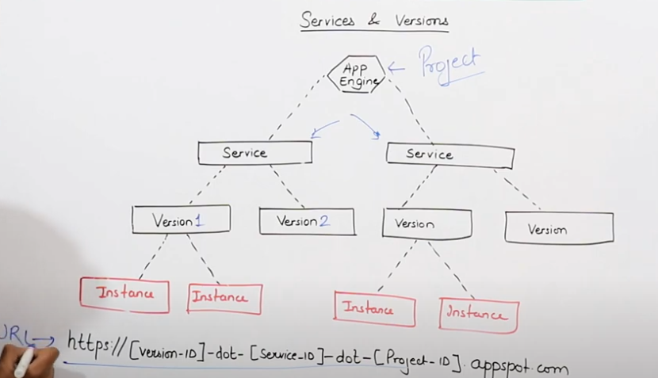
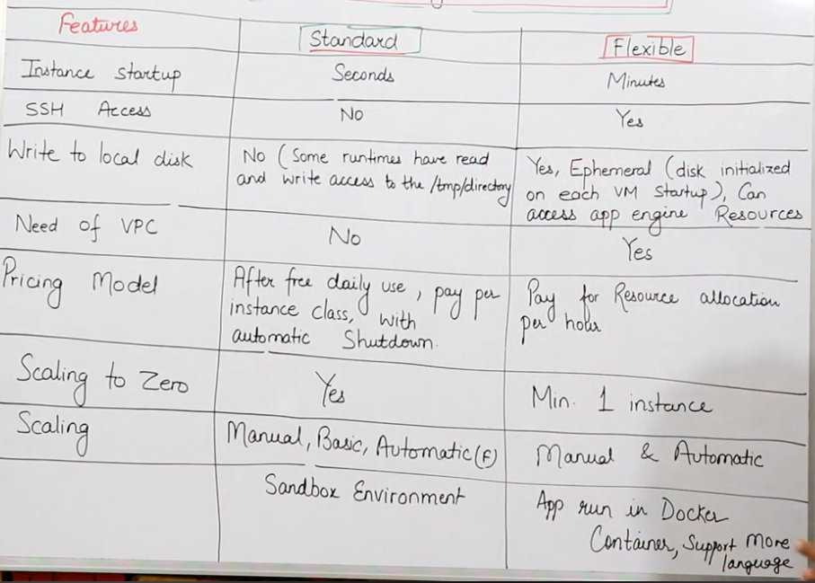

## **How IAP Works**
- IAP provides a **central authorization layer** for applications accessed over HTTPS.
- It enables **application-level access control**, reducing reliance on network-based security measures like firewalls.
- Access is only granted to **authenticated and authorized users** with the correct IAM roles.

### **Key Features of IAP**
✅ **No VPN Required** – IAP does not use or support VPNs.  
✅ **Global Access** – Users can access IAP-protected web applications from anywhere.  
✅ **Zero-Trust Security Model** – IAP enforces identity-based access control rather than trusting network location.  
✅ **Google Workspace Support** – IAP works with **Google Workspace accounts** (previously G Suite).  
✅ **Broad Platform Support** – IAP secures applications running on **Cloud Run, Compute Engine, Google Kubernetes Engine (GKE), and even on-premises resources**.  

## App Engine - Standard & Flexible  
### Google's PaaS Offering  
App Engine is Google's managed platform for running applications.   
- The App Engine is a compute service that provides a managed platform for running applications.  
- As this is a managed service, your focus should be on running the application only and managing the resources needed for the application.  
- It was one of GCP's earliest services, introduced by Google in 2008.  
- Applications in App Engine run across multiple servers.  
- **No Usage Charges** - Pay for resources provisioned.  
### Comparison with Other Services  
| Google             | Other Cloud Providers           |  
|--------------------|--------------------------------|  
| App Engine         | AWS Elastic Beanstalk          |  
|                    | Azure App Service               |  
| GKE                |                                |  
| Cloud Run          |                                |  

### Serverless IaaS   
- This highlights the serverless aspect of App Engine, emphasizing its capabilities as an Infrastructure as a Service (IaaS).

---

* App Engine makes deployment, maintenance, and scalability easy. So that the user may focus on innovation.
* Automatic Load Balancing and Scaling
* Application Versioning and Traffic Splitting
* Supports Several Programming Languages like Go, Python, Java, NodeJS, .Net & Ruby

Suitable for Web applications.








| Feature             | Compute Engine                               | App Engine                                   |
|----------------------|---------------------------------------------|---------------------------------------------|
| Service Model        | IaaS (Infrastructure as a Service)          | PaaS (Platform as a Service)                 |
| Type of Service      | Unmanaged                                   | Managed by Google                           |
| Control Over Resources| More Control and Flexibility                | Less Control Over Computing Resources          |
| Cost                 | Less (presumably compared to App Engine)    | High (presumably compared to Compute Engine)  |
| Running Instance     | Min. 1                                      | Zero                                         |
| Autoscaling          | Slow Autoscaling                             | Autoscaling                                  |


---

## **Google App Engine (GAE) Standard Deployment Guide**  

### **1️⃣ Setting Up the Project**
1. **Create a New Project**  
   ```sh
   gcloud projects create [PROJECT_ID]
   ```
2. **Open Cloud Shell**  
   - Navigate to the Cloud Shell in the GCP Console.

---

### **2️⃣ Uploading and Preparing Files**
1. **Upload a folder in Cloud Shell** (Manually upload via Cloud Console or use `gsutil cp` for Google Cloud Storage).  
2. **Navigate to the folder**  
   ```sh
   cd gae-file
   ```
3. **Verify files**  
   ```sh
   ls
   ```
   Expected files:  
   - `app.yaml`
   - `package.json`
   - `server.js`

---

### **3️⃣ Deploying the Application**
1. **Initialize App Engine (if required)**  
   ```sh
   gcloud app create
   ```
2. **Deploy the application**  
   ```sh
   gcloud app deploy
   ```

---

### **4️⃣ Autoscaling & Load Testing**
1. **Install Apache Benchmark (if not already installed)**  
   ```sh
   sudo apt install -y apache2-utils
   ```
2. **Run load testing with Apache Benchmark**  
   ```sh
   ab -c 1000 -n 10000 "URL_OF_APPENGINE"
   ```
   - `-c 1000`: Simulates **1000 concurrent users**.  
   - `-n 10000`: Sends **10,000 requests** in total.  

---

### **5️⃣ Versioning & Managing Services**
#### **Versioning**
1. **Make changes** in `server.js` (e.g., modify responses, logging, or endpoints).  
2. **Deploy a new version**  
   ```sh
   gcloud app deploy -v version2
   ```

#### **Creating a New Service**
1. **Modify `app.yaml` for a new service**  
   ```sh
   vi app.yaml
   ```
   Example:
   ```yaml
   runtime: nodejs10
   service: service2
   ```
2. **Deploy the new service**  
   ```sh
   gcloud app deploy -v service2va2
   ```

---

### **Summary of Commands**
| Action | Command |
|---------|---------|
| **Create App Engine** | `gcloud app create` |
| **Deploy App** | `gcloud app deploy` |
| **List Files** | `ls` |
| **Navigate to Directory** | `cd gae-file` |
| **Autoscaling Test** | `ab -c 1000 -n 10000 "url"` |
| **Deploy New Version** | `gcloud app deploy -v version2` |
| **Create New Service** | `gcloud app deploy -v service2va2` |


---

### **Question 1: Choosing the Right Environment**

**Scenario:**  
Your team is building a web application expected to have rapid scaling requirements with occasional bursts of traffic. The application must start up quickly and handle unpredictable traffic without manual intervention.

**Which App Engine environment should you choose?**

A. **App Engine Standard Environment**  
B. App Engine Flexible Environment  
C. Google Compute Engine with manual scaling  
D. Google Kubernetes Engine

**Correct Answer:** A. **App Engine Standard Environment**

**Explanation:**  
The Standard environment is optimized for rapid scaling and fast instance startup times. It automatically scales based on traffic, making it well-suited for applications with bursty or unpredictable traffic patterns. While the Flexible environment offers more customization (e.g., custom runtimes and extended libraries), it typically has longer startup times and may not be as cost‑efficient for quick, short-lived requests. Compute Engine and Kubernetes Engine require more manual management of scaling, making them less ideal for your scenario.

---

### **Question 2: Managing Multiple Application Versions**

**Scenario:**  
You have deployed several versions of your application on App Engine for testing. After identifying a problem with one of the versions, you want to ensure that all production traffic is routed only to the stable version.

**What is the best approach to achieve this?**

A. Delete the problematic version immediately  
B. Update the `app.yaml` to disable the version  
C. Use App Engine’s traffic splitting feature to direct 100% of traffic to the stable version  
D. Redeploy the stable version as a new service

**Correct Answer:** C. **Use App Engine’s traffic splitting feature to direct 100% of traffic to the stable version**

**Explanation:**  
App Engine’s traffic splitting feature lets you manage how requests are distributed among different versions of your application. In this case, you can configure the settings so that 100% of incoming traffic is directed to the stable version while keeping the other versions available for testing or rollback if needed. This approach minimizes downtime and risk compared to immediately deleting or disabling a version.

---

### **Question 3: Securing Sensitive Information**

**Scenario:**  
Your App Engine application requires access to sensitive API keys and configuration settings. You need to ensure that these secrets are stored securely and accessed only by authorized parts of your application.

**What is the best practice for managing these credentials?**

A. Hardcode them directly into your source code  
B. Store them as environment variables in `app.yaml`  
C. Use Google Secret Manager integrated with your App Engine application  
D. Save them in a publicly accessible Cloud Storage bucket

**Correct Answer:** C. **Use Google Secret Manager integrated with your App Engine application**

**Explanation:**  
Storing sensitive information directly in the source code or in publicly accessible files is insecure. Although you can define environment variables in `app.yaml`, Secret Manager provides enhanced security, access control, and auditing for sensitive data. By integrating Secret Manager with your App Engine application, you ensure that secrets are managed and rotated securely without exposing them in your codebase or configuration files.

---

### **Question 4: Troubleshooting Performance Issues**

**Scenario:**  
During peak traffic hours, you notice that your App Engine application experiences sporadic performance degradation. You suspect that the issue might be related to instance startup times (cold starts).

**What should you investigate and optimize to address this issue?**

A. Increase the memory allocation for each instance  
B. Adjust instance scaling settings and configure warm-up requests  
C. Switch to the Flexible environment  
D. Change your application’s domain name

**Correct Answer:** B. **Adjust instance scaling settings and configure warm-up requests**

**Explanation:**  
Cold starts can occur when a new instance spins up to handle traffic. In App Engine Standard, you can mitigate cold starts by configuring warm-up requests. This feature pre-initializes instances before they start receiving actual user requests, which improves responsiveness during traffic spikes. Adjusting the scaling settings (such as minimum instances) also helps maintain a pool of warm instances ready to handle incoming traffic.

---

### **Question 5: Deploying a Custom Runtime**

**Scenario:**  
Your application depends on a custom runtime and third-party libraries that are not supported by App Engine Standard. You need to deploy your application without having to modify your codebase significantly.

**What is your best deployment strategy?**

A. Modify your application to fit within the constraints of the Standard environment  
B. Use Google Cloud Functions instead  
C. Migrate to App Engine Flexible Environment with a custom runtime  
D. Deploy on Compute Engine and manage the runtime manually

**Correct Answer:** C. **Migrate to App Engine Flexible Environment with a custom runtime**

**Explanation:**  
When your application requires a custom runtime or libraries not supported in the Standard environment, the Flexible environment is designed to handle these scenarios. It allows you to define a custom Docker container, giving you full control over the runtime and dependencies. This approach enables you to deploy your application with minimal code changes while still benefiting from managed scaling and other App Engine features. Although Compute Engine offers complete control, it also requires more manual configuration and management compared to the Flexible environment.

---
